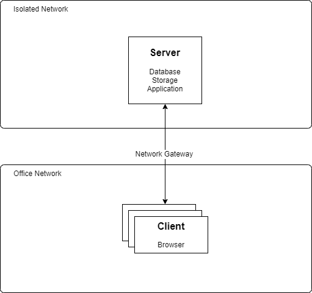

# AAS System Design

## 1. Overview

The AAS (Automated Application System) aims to provide a robust and efficient platform for handling specific business operations. The system will consist of a web-based client application and a server-side backend to manage data, logic, and integration.

---

## 2. Network Design

### 2.1 Network Architecture

- **Isolated Network Setup:** The client will provide an isolated network, which could either be a dedicated subnet under the existing office network or a repurposed abandoned network segment.
- **Responsibilities:**  
    - Network configuration and maintenance will be managed by the client; USC is not responsible for network configuration.
    - The client is responsible for establishing and maintaining the connection between client devices and the server within the isolated network.
    - The client must provide and maintain a **Network Gateway** to connect the isolated subnet with the office network, ensuring secure and reliable communication between client devices and the server.
- **Connectivity Requirements:**
    - Support for **TCP/IP (10/100/1000 Mbps)** connections.
    - No need for internet access.
    - No firewall or network restrictions unless specified by the client.

### 2.2 Network Diagram 
  
*Fig 1: Network diagram for AAS*

---

## 3. Server Specification

### 3.1 Server Responsibilities

- **Database Management:** PostgreSQL 17.x for data storage and management.
- **Storage Management:** Handling file storage and backups.
- **Application Hosting:** Running web application providing RESTful API / GraphQL services

### 3.2 Server Configuration

- **Operating System:** Linux Ubuntu 24.x
- **Database:** PostgreSQL 17.x
- **Hardware:**
    - **CPU:** Intel i5 (2GHz or higher)
    - **RAM:** 32GB DDR4
    - **Storage:** 256GB SSD (for OS and applications) + 1TB HDD (for data storage)  
    - **Network Interface:** Ethernet (10/100/1000 Mbps)

---

## 4. Client Requirements

- **Supported Browsers:** Modern browsers such as Chrome, Edge, Firefox, and Safari
- **Network Interface:** LAN with support for TCP/IP connectivity

---

## 5. Application Design

### 5.1 AAS Web Application

- **Platform:** Web-based, accessible via modern browsers
- **Deployment:** No installation required, served over the internal network
- **Core Features:**
    - User Authentication and Identity Management
    - Ranking Logic and Performance Metrics
    - Support for multiple base time features
    - Data synchronization with the server

### 5.2 Server Application

- **Architecture:** Node.js
- **Interface:** API / GraphQL for data access and integration
- **Functionalities:**
    - Identity Service (Authentication)
    - Ranking Logic Enhancement
    - User Time Management (Base Time Feature)
    - Migration of existing application logic to server-side
    - Transition from SQLite to PostgreSQL for database management

---

## 6. Data Backup and Disaster Recovery (DR) Plan

- **Automated Data Backup:**

    - Scheduled backups from the server to external local media.
    - Regular snapshots of the PostgreSQL database.
    - Backup of application data and configuration files.

- **Disaster Recovery Plan:**

    - Clear documentation of recovery procedures.
    - Periodic testing of backup restoration processes.
    - Defined Recovery Time Objectives (RTO) and Recovery Point Objectives (RPO).

---

## 7. Conclusion

The proposed system design ensures a balanced approach between functionality, performance, and security. By leveraging a web-based client application and a robust server backend, AAS will offer users an intuitive and efficient experience while maintaining data integrity and reliability.

## Cost Calculation
 Item | QTY | Unit Cost | Amount
 -- | -- | -- | --
 Server | 1 | |
 Database Migration | 2 days | 2000 | 4000
 Identity Service | 2 days | 2000 | 4000