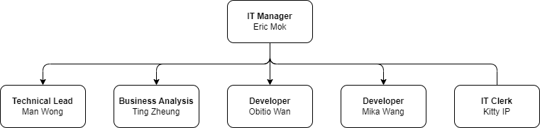

# Organization of IT Team in USC

## Position and Responsibilities
### Technical Lead Responsibilities

- **Technical Guidance**: Provide technical direction for the development team. This includescode reviews, troubleshooting, and mentoring team members.  
- **Project Management**: Oversee project progress to ensure timelines and quality standardsare met.  
- **Stakeholder Communication**: Act as a liaison between the technical team and stakeholders, translating technical concepts into understandable terms.  
- **Decision Making**: Make key decisions on technologies and architectures to be used inprojects.  
- **Risk Management**: ldentify potential technical risks and develop mitigation strategies,  

### Business Anaylsis Responsibilities

- **Engage Stakeholders**: Initiate dialogues with stakeholders to understand their needs andexpectations. This includes conducting interviews, workshops, and focus groups.  
- **Conduct Market Research**: Perform in-depth market research to gather insights aboutindustry trends, competitor strategies, and customer preferences.  
- **Documentation**: Develop comprehensive documentation to ensure clear communicationof requirements and strategies. This includes:  
    - **Business Requirement Document (BRD)**: Detail the business solutions for a project, including the documentation of customer needs and expectations.  
    - **User Acceptance Testing (UAT) Plan**: Outline the details of the UAT process. including the testing approach, resources, schedules, and expected outcomes.  
    - **User Guide**: Create user manuals that detail the functionality of the system or product, designed to assist end-users in utilizing the product effectively.  
    - **Training Material**: Develop comprehensive training materials for differentstakeholders, ensuring they can effectively use and manage the system or product.Wireframes/Prototypes: Design and develop wireframes or prototypes to givestakeholders a tangible view of the system or product.  
- **Project Tracking**: Monitor project progress to ensure that development is on schedule andaligns with the reguirements. This includes tracking milestones, managing risks, andmaintaining open communication with the project team and stakeholders.

### Developer Responsibilities

- **User Interface Design:** 
    - Develop user-friendly navigation and responsive layouts.
    - Use languages like **HTML**, **CSS**, and **JavaScript** to create visually appealing web pages.

- **User Experience:** 
    - Ensure the design is optimized for various devices with different screen sizes and orientations.
    - Implement interactive features to enhance user engagement.

- **Performance Optimization:** 
    - Optimize the application's performance to ensure fast loading speed and smooth transitions.

- **Debugging/Testing:** 
    - Test and debug both front-end and back-end code.
    - Perform unit testing, integration testing, and debugging using tools like **Jasmine**, **Mocha**, **Jest**, **JUnit**, **NUnit**, or **PyTest**.

- **Server-Side Logic:** 
    - Write server-side code for web applications.
    - Implement algorithms and data manipulation operations that drive the site's functionality.

- **Database Management:** 
    - Handle database operations such as **queries** and **manipulations**.
    - Perform **CRUD operations** (Create, Read, Update, Delete) with databases like **MySQL**, **MongoDB**, or **PostgreSQL**.

- **API Integration:** 
    - Develop and manage **APIs** to allow communication between different parts of the application.

- **Security:** 
    - Implement security measures to protect sensitive data.
    - This includes **data encryption**, **user authentication**, and **secure data transmission**.

- **Collaboration:** 
    - Work closely with **Business Analysts (BA)** and **Solution Architects (SA)** to implement the visual design.
    - Collaborate with other developers to integrate the front-end with the server-side application.

### IT Clerk Responsibilities

- **Administrative Support:** Provide administrative assistance to the IT department, including scheduling meetings, managing documentation, and maintaining records.

- **Help Desk Assistance:** Assist with basic IT support tasks such as password resets, software installations, and handling user queries.

- **Asset Management:** Maintain an inventory of IT equipment and software licenses, including asset tagging, allocation, and documentation.

- **Data Input and Maintenance:** Accurately input and update data into various systems, ensuring accuracy, consistency, and compliance with data management policies.

- **Document Management:** Organize, manage, and maintain IT documents, including policies, procedures, technical manuals, and user guides.

- **User Guide Preparation:** Develop simple, clear, and concise user guides and manuals by compiling information from IT staff, ensuring end-users understand how to use systems and applications.

- **Testing Support (UAT):** Participate in User Acceptance Testing (UAT) by executing test cases, documenting results, identifying issues, and reporting discrepancies to the IT team.

- **Website Content Management:** Utilize content management systems (e.g., WordPress) to update and maintain static websites by uploading content, images, and multimedia materials as provided by the team.

- **Collaboration:** Work closely with IT staff, business analysts, and end-users to ensure smooth communication, accurate information exchange, and support project and operational needs.

- **Reporting and Documentation:** Generate basic reports, maintain records of activities, and document processes to support IT department operations.

- **Confidentiality:** Handle sensitive information with discretion and ensure compliance with company data security and privacy policies.
