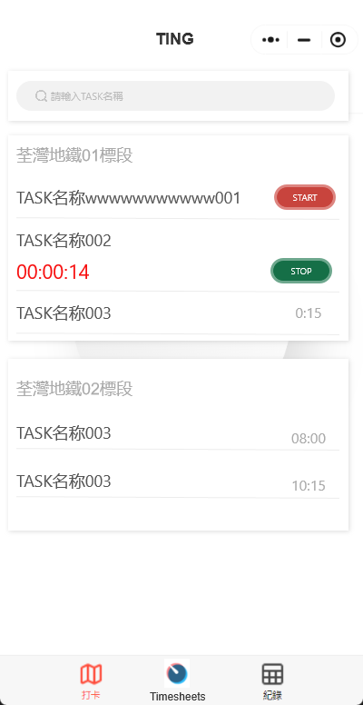

# 业务需求文档 (BRD)

## 项目：移动应用集成 Odoo 工时表模块  

### 1. 介绍  
#### 1.1 目的  
本文件概述了在现有移动应用中集成 Odoo 工时表模块的业务需求。其目标是使用户能够高效地为分配的项目和任务进行签到和签退。  

#### 1.2 范围  
- 在移动应用中新增 **工时表** 选项卡  
- 允许用户对 **分配的项目/任务** 进行签到和签退  
- 将工时表数据与 **Odoo 后端** 同步  
- 确保 **基于角色的访问控制 (RBAC)** 进行时间跟踪  
- 实现 **离线模式支持** 以记录签到/签退  
- 允许用户 **按人员查看工时跟踪记录**  

  

#### 1.3 目标  
- 简化现场和远程员工的工时录入流程  
- 提高 **数据准确性** 和 **实时跟踪能力**  
- 通过简化时间记录提升 **用户体验**  
- 确保与现有 Odoo 工时表模块的 **无缝集成**  

### 2. 业务需求  
#### 2.1 功能需求  
1. **移动应用工时表选项卡**  
      - 新增 **工时表** 版块，可从导航菜单访问  

2. **签到 / 签退功能**  
      - 用户可以对某个项目/任务签到  
      - 用户可以签退并填写可选备注  
      - 显示当前签到时间的计时  
      - 列出所有有效的工程/任务, 让用户自行选择  
      - 同一时间只可以对一个任务签入  
      - 在已有签入任务的情况下签入另一任务时, 提示用户确认签入另一任务, 若用户确认签入, 则同时应先签出上一任务再签入下一任务。  

3. **项目与任务选择**  
      - 用户只能看到 **自己被分配的项目/任务**  
      - 可按项目/任务进行搜索和筛选  

4. **工时表同步**  
      - 将签到/签退记录同步到 **Odoo 后端**  
      - 在同步前进行数据验证  

5. **用户通知与提醒**  
      - 提醒用户未完成的签退操作, 若员工在签到某一任务超过 8 小时, 作出推送提示  
      - 每日提供工时统计摘要  

6. **查看工时跟踪记录**  
      - 用户可以查看自己的签到/签退历史记录  
      - 主管可以查看其团队成员的工时表记录 (在网页版)  
      - 可按日期、项目和任务筛选和搜索工时表记录  

#### 2.2. 案例与解决方案  
##### 正常签到流程  
1. 用户打开移动应用并进入 工时表 选项卡。
2. 选择需要签到的 项目/任务。
3. 点击 签到 按钮，系统记录签到时间。
4. 应用显示签到成功提示，并开始计时。
5. 用户可在任务详情页查看当前签到状态。
6. 在列出時, 同一工程下的任務放在同一 `Card` 內
##### 正常签退流程  
1. 用户进入 工时表 选项卡。
2. 选择当前已签到的 项目/任务。
3. 点击 签退 按钮，系统记录签退时间。
4. 可填写备注（如完成进度或其他说明）。
5. 应用显示签退成功提示，并结束计时。
6. 用户可在签到记录页面查看历史记录。
##### 在签到时已有其他未签出的记录  
1. 用户尝试签到新的任务时，系统检测到已有未签出的任务。
2. 应用弹出提示，提醒用户当前仍有一个正在进行的任务。
3. 用户可以选择：
      - 取消当前签到操作，保持原任务签到状态。
      - 确认继续签到新任务，系统会自动签出先前的任务后，再签到新任务。
4. 记录切换任务的时间戳，并同步到 Odoo 后端。
5. 用户可在签到记录页面查看任务切换的详细信息。
##### 签到超过 8 小时未签出  
1. 用户签到任务后，若超过 8 小时仍未签出，系统会自动发送推送通知提醒。
1. 若用户仍未操作，系统每小时重复提醒一次，直至用户签出或管理员干预。
1. 主管可在管理后台查看超时未签出的记录，并有权限手动签出。
1. 在用户下次打开应用时，系统会弹出提示，要求用户补充超时原因，并确认签出。
1. 所有超时签到的记录将存入日志，并同步至 Odoo 后端，以供审核和报表统计。

##### 签到时没有联网  
1. 用户尝试签到时，如果设备未连接到互联网，系统会弹出提示，提醒用户当前处于离线状态，并禁止签到操作。
1. 用户需要等待网络恢复后，才能进行签到。
1. 若用户尝试离线签到，系统会显示错误信息，并引导用户检查网络连接。
1. 所有签到/签退操作必须在联网状态下完成，以确保数据的实时同步和准确性。

#### 2.3 非功能性需求  
- **性能要求：** 数据同步时间不超过 5 秒  
- **安全性要求：** 使用 AES256 加密工时表数据  
- **可扩展性：** 支持 10,000+ 用户  
- **可用性：** 确保移动端友好的 UI/UX  
- **合规性：** 遵循 **GDPR 及公司政策**  

### 3. 假设与约束  
#### 3.1 假设  
- 用户拥有 **有效的 Odoo 账号**  
- 移动应用支持 **推送通知**  
- Odoo 工时表模块的 API 可用  

#### 3.2 约束  
- 仅适用于 **Android & iOS** (不支持网页端)  

### 4. 依赖关系  
- **Odoo API** 可用于工时表数据同步  
- **Odoo 用户角色管理**  

