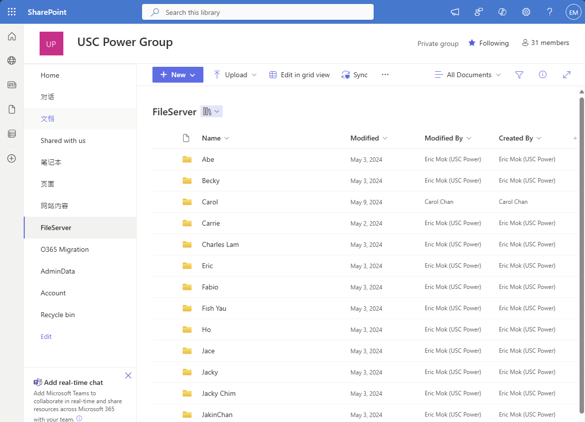
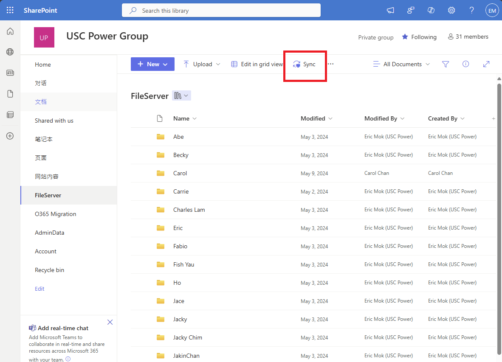

# **📌 User Guide: Access SharePoint Document Library with OneDrive**

## **1️⃣ Why Use OneDrive to Access SharePoint Document Library?**
OneDrive helps users sync SharePoint document libraries to their local computer, allowing **offline access, auto-sync, and easy file collaboration**. 

### **🔹 Benefits of Syncing SharePoint Document Library with OneDrive**
✅ **Offline Access** – Work on files even without an internet connection. Changes sync automatically when online.  
✅ **Automatic Sync** – Any changes made to files in OneDrive or SharePoint are synced across all devices.  
✅ **Easy Collaboration** – Co-edit files with teammates in real-time using Microsoft 365 apps.  
✅ **Security & Backup** – Files remain securely stored in the cloud, reducing data loss risks.  

---

## **2️⃣ Install OneDrive on Windows & Mac**
### **🔹 Windows**
1. **Check if OneDrive is Installed**  
      - **Windows 10/11**: OneDrive comes pre-installed. Click the **cloud icon** in the taskbar.  
      - If OneDrive is missing, [Download OneDrive](https://www.microsoft.com/en-us/microsoft-365/onedrive/download) from Microsoft’s official site.  

2. **Install OneDrive (if needed)**  
      - Run the **OneDriveSetup.exe** file and follow the on-screen instructions.  

### **🔹 Mac**
1. Download **OneDrive for Mac** from the **Mac App Store** or [Microsoft OneDrive Website](https://www.microsoft.com/en-us/microsoft-365/onedrive/download).  
2. Open the **OneDrive app**, sign in with your **Microsoft 365 Company Account**.  
3. Complete the setup process and allow OneDrive to run in the background.  

---

## **3️⃣ Sign in to OneDrive with Your Company Account**
1. Open **OneDrive** on your device.  
2. Enter your **company email (e.g., yourname@yuscpower.net)** and click **Sign In**.  
3. Authenticate with **Multi-Factor Authentication (if required)**.  
4. Follow the setup wizard and choose a **local folder location** for OneDrive.  

---

## **4️⃣ Access SharePoint Document Library with OneDrive**
Once logged into OneDrive, you can access your **SharePoint Document Library** using a direct link provided by your IT team or manager.

### **🔹 Steps to Open Document Library**
1. **Get the SharePoint Library Link**  
      - Open the email or message from your IT admin containing the **SharePoint Document Library link**.
      - Example: `https://uscpower.sharepoint.com/sites/USCPower/FileServer/Forms/AllItems.aspx`  
      

2. **Open the Document Library in SharePoint**  
      - Click the provided link to open **SharePoint Online** in your web browser.  
      - Navigate to **Documents** in the left menu.

---

## **5️⃣ Sync SharePoint Document Library with OneDrive**
To make the SharePoint Document Library available on your local computer:

### **🔹 Steps to Sync a SharePoint Library**
1. **Go to SharePoint Online**  
      - Open the **SharePoint site** containing the document library.  
      - Click **Documents** to access shared files.  

2. **Click the "Sync" Button**  
      - In the SharePoint document library, click the **"Sync"** button (⚡).  
      - This will prompt OneDrive to start syncing the folder to your computer.  
      

3. **Grant Permission & Start Syncing**  
      - If prompted, allow the **OneDrive app** to open.
      - OneDrive will now **sync the SharePoint document library** to a folder on your local computer.  
      - The folder will appear in **File Explorer (Windows)** or **Finder (Mac)** under:  
          - 📁 **OneDrive – Your Company**  
          - 📁 **SharePoint – [Library Name]**  

4. **Verify the Sync Status**  
      - Click the **OneDrive cloud icon** in the system tray (Windows) or menu bar (Mac).  
      - Ensure the status shows **"Up to date"** (✔).  

---

## **6️⃣ How Files Sync & Collaboration Works**
Once synced, all **changes are automatically reflected in both OneDrive and SharePoint**.

### **🔹 How Sync Works**
- **Online & Offline Sync** – Work on files offline, and OneDrive syncs changes when back online.  
- **Two-Way Sync** – Any changes made locally reflect in SharePoint, and vice versa.  
- **Real-Time Updates** – If a team member edits a document in SharePoint, the synced file updates in your OneDrive folder.  

### **🔹 Collaboration with Teams**
- **Co-Authoring** – Open Microsoft Office files (Word, Excel, PowerPoint) and edit in real-time with colleagues.  
- **Version Control** – SharePoint keeps a history of file changes.  
- **File Sharing** – Share synced files via **email, Teams, or OneDrive links**.  

---

## **7️⃣ Managing Synced Files**
### **🔹 Stop Syncing a SharePoint Library**
If you no longer need to sync a SharePoint document library:  

1. Click the **OneDrive cloud icon** in the taskbar/menu bar.  
2. Go to **Settings** > **Account** > **Stop Syncing a Folder**.  
3. Select the **SharePoint library** you want to stop syncing.  
4. Click **Stop Sync**.  

🔹 **Note:** Stopping sync **does not delete files from SharePoint**, only from your local device.

---

## **📌 Summary**
| **Action** | **Steps** |
|------------|----------|
| **Install OneDrive** | Download from Microsoft and set up |
| **Sign in to OneDrive** | Use your company account |
| **Access SharePoint Document Library** | Open the provided link in a browser |
| **Sync SharePoint Library with OneDrive** | Click the **"Sync"** button in SharePoint |
| **Work on files locally** | Use File Explorer/Finder to access files |
| **Collaborate in real-time** | Edit files in Office apps, changes sync instantly |
| **Stop syncing if needed** | OneDrive settings > Stop Sync |

---

## **🎯 Final Tips**
✅ **Use OneDrive for Business**, not personal OneDrive, to sync SharePoint files.  
✅ **Do not rename or move SharePoint folders in OneDrive**, as this can break sync.  
✅ **Check the OneDrive sync icon** – Green ✔ means up to date, Blue 🔄 means syncing.  
✅ **Use "Always keep on this device"** for offline access to important files.  
