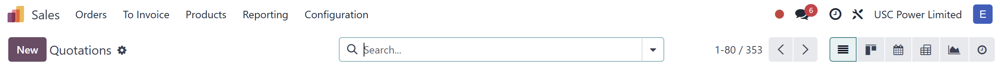

# USC Odoo User Guide - Navigating the Odoo Interface  

## Overview  
Once logged into the USC Odoo system, understanding how to navigate the interface efficiently will help you complete tasks quickly and accurately. This section covers the main interface components and tips for effective use.

---

## Key Components of the Odoo Interface  

### 1. **Dashboard**  
- The dashboard is the first screen you see after logging in.  
- It provides a quick overview of key metrics and shortcuts to frequently used modules.  

  
*Figure 1: Odoo Dashboard with module shortcuts and key performance indicators.*  

---

### 2. **Top Navigation Bar**  

The top navigation bar is always visible and provides quick access to essential tools:  

- **Search Bar:** Allows you to search for records, contacts, sales orders, and more.  
- **Apps Menu:** The grid icon on the left lets you switch between modules (e.g., Sales, CRM, Purchase, Project).  
- **User Menu:** The profile icon on the right allows access to:  
  - **Profile Settings**  
  - **Preferences**  
  - **Log Out**  

  
*Figure 2: Top navigation bar with search, app menu, and user settings.*  

---

### 3. **Module Navigation Panel**  

- When you enter a module (e.g., Sales), the left sidebar displays specific options related to that module.  
- The panel provides access to different views such as **List**, **Kanban**, **Calendar**, **Gantt**, **Pivot**, and **Graph**.  
 
  
*Figure 3: Menu with module-specific options and views.*  

---

### 4. **Main Workspace**  

- The main area displays the content based on your selection.  
- Supports various views and actions, such as:  
  - Viewing and editing records  
  - Creating new entries (e.g., new sales orders, opportunities)  
  - Filtering and sorting data  

  
*Figure 4: Main workspace showing records in list view with available actions.*  

---

### 5. **Breadcrumbs**  

- Breadcrumbs appear at the top of the main workspace to help track your location within the system.  
- They allow quick navigation back to previous pages.  
 
  
*Figure 5: Breadcrumbs showing the navigation path within a module.*  

---

## Common Interface Elements  

### 1. **Buttons and Actions**  
- **Create:** Adds new records (e.g., new contact, new sales order).  
- **Save:** Saves changes to a record.  
- **Edit:** Switches to edit mode for records.  
- **Discard:** Cancels changes made in edit mode.  
- **Action Menu:** Provides advanced options such as **Export**, **Duplicate**, **Archive**, and **Delete**.  
 
  
*Figure 6: Common action buttons for record management.*  

*Figure 6.1: Save button*

*Figure 6.2: Discard button*

---

### 2. **Filters and Search**  
- Use the search bar with filters and **Advanced Search** to find specific data quickly.  
- Combine filters and group by options to refine your view.  

  
  
*Figure 7: Using search and filters to find records efficiently.*  

---

## IT Support Contact  

- **Email:** [ericmok@uscpower.net](mailto:ericmok@uscpower.net)  
- **Phone:** +852 6622 7663  

---

[<- Back to Index](../../user-guide.index.md)  
