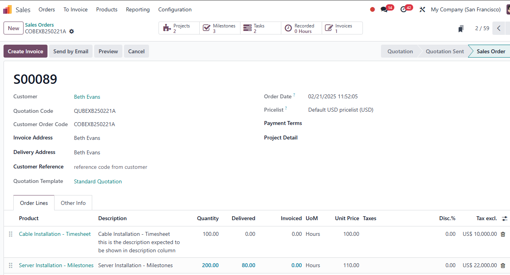

# USC Odoo User Guide - Convert Quotation to Sales Order

## Overview
Converting an approved quotation into a sales order in Odoo is a crucial step in finalizing the sales process. This ensures that all terms agreed upon in the quotation are accurately transferred into a formal sales order, allowing project execution and delivery management to proceed.

---

## Prerequisite

Before converting a quotation to a sales order, make sure you have completed the following steps:

- [Quotation Approval](./quotation-approval.md)

Also, ensure you are logged into the Odoo system:

- [How to Log into Odoo](../getting-start/logging-into.md)

---

## Key Requirements

- **Approved Quotation:** Only approved quotations can be converted to sales orders.
- **Cost Sheet Attached:** Ensure the cost sheet is attached to the quotation.
- **Product and Customer Information:** Verify that all details are accurate before conversion.
- **Project, Delivery, and Milestone Automation:** Understand how product type and invoicing policy influence automation.

---

## Step-by-Step Instructions

### 1. Accessing the Sales Module

1. **Log into Odoo:** Ensure you are logged into the USC Odoo system.
2. **Navigate to Sales:**
      - Click on the **Apps Menu** (grid icon) in the top navigation bar.
      - Select **Sales** from the list of available modules.

---

### 2. Converting the Quotation

1. **Open the Approved Quotation:**
      - Go to the **Quotations** section within the Sales module.
      - Locate and open the approved quotation that needs to be converted.

2. **Check Required Information:**
      - Ensure that the cost sheet is attached.
      - Verify the product and customer information.

3. **Convert to Sales Order:**
      - Click the **Confirm** button to convert the quotation into a sales order.
      - The status of the document will change from **Quotation** to **Sales Order**.

> The Sale Order Number will be generated automatically once the quotation is confirmed. The prefix `QU` in the quotation number will be replaced with `SO`, while the rest of the number will remain unchanged.

---

### 3. Project, Delivery, Milestone, and Timesheet Automation

The automation of project creation, delivery orders, milestones, and timesheets in Odoo depends on the **product type** and **invoicing policy** settings of the products included in the sales order.

#### **1. Product Type Influence**

- **Service Products:**
     - When the product type is set to **Service**, Odoo can automatically create projects and enable timesheet logging.
     - If the invoicing policy is set to **Milestone**, milestones will be automatically generated as project tasks.

- **Stockable Products:**
     - Automatically generate **Delivery Orders** to manage inventory and logistics workflows.
     - Supports invoicing based on **Delivered Quantities**, aligning stock movements with sales.

#### **2. Invoicing Policy Impact**

- **Ordered Quantities:**
     - Allows invoicing as soon as the sales order is confirmed.

- **Delivered Quantities:**
     - Invoices are generated only after delivery is completed, useful for tangible products.

- **Milestone:**
     - Projects linked to service products with a milestone invoicing policy will automatically generate milestones.
     - These milestones are tied to the project timeline, allowing partial invoicing upon milestone completion.

> For detail, refer to [Product Management](../order-management/product-management.md)

---

### 4. Validating the Sales Order

1. **Review Sales Order Details:**  
      - Double-check all information transferred from the quotation.
      - Ensure the sales order reflects accurate pricing, quantities, and terms.

2. **Attach Additional Documents:**  
      - If needed, attach any additional files, including updated customer purchase orders or project details.

3. **Save and Validate:**  
      - Click **Save** to ensure all changes are recorded.

---

## Best Practices

- **Always Use Approved Quotations:** Never convert a quotation to a sales order without proper approval.
- **Maintain Accurate Records:** Attach all relevant documents to the sales order for easy reference.
- **Communicate with Project Teams:** Ensure that the project team is notified once the sales order is confirmed.

---

## Troubleshooting

### 1. Cannot Convert Quotation
- **Check Approval Status:** Ensure the quotation is marked as approved.
- **Verify Attachments:** Make sure the cost sheet is attached to the quotation.
- **Missing Information:** Review all required fields before conversion.

### 2. Incorrect Sales Order Details
- **Edit the Sales Order:** If mistakes are found, edit the sales order before saving and confirming.
- **Contact IT Support:** If the issue persists, reach out to the IT team for assistance.

---

## IT Support Contact

- **Email:** [ericmok@uscpower.net](mailto:ericmok@uscpower.net)
- **Phone:** +852 6622 7663

---

[<- Back to Index](../../user-guide.index.md)

