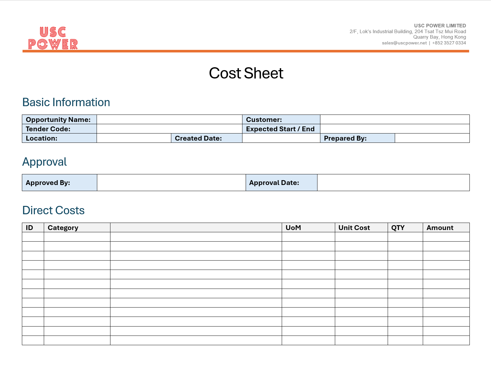

# USC Odoo User Guide - Cost Sheet Preparation

## Overview
A well-prepared cost sheet is a critical component in the quotation management process, ensuring accurate pricing, profitability analysis, and risk management. At USC, cost sheets are required for all types of deals, including construction projects, trading transactions, and mixed deals.

---

## Purpose of Cost Sheet

The cost sheet serves several essential purposes:  

- **Accurate Pricing:** Ensures all costs are accounted for, including direct and indirect expenses.
- **Profitability Analysis:** Helps calculate potential profits by comparing costs with expected revenues.
- **Risk Management:** Assists in identifying potential cost overruns or risks associated with a project or deal.

---

## Types of Deals
 
1. **Construction Projects:**  
      - Involves costs related to labor, materials, subcontractors, equipment, and site management.

2. **Trading Transactions:**  
      - Covers costs for sourcing, purchasing, logistics, storage, and handling.

3. **Mixed Deals:**  
      - Combines construction and trading elements, requiring a comprehensive cost breakdown.

---

## Cost Sheet Format

The cost sheet format provided by USC applies to all kinds of deals. The template is structured into the following sections:

### 1. **Project/Deal Information:**
- Opportunity Name
- Tender Code
- Customer
- Project Location
- Expected Start and End Dates

### 2. **Direct Costs:**
- **Materials:** Raw materials, purchased goods, and supplies.
- **Labor:** Wages, benefits, and related expenses.
- **Subcontractors:** Fees for external services.
- **Equipment:** Rental and operational costs of machinery and tools.
- **Logistics:** Shipping, storage, and handling expenses.

### 3. **Indirect Costs:**
- **Overheads:** Administrative expenses, utilities, and office support.
- **Insurance & Permits:** Compliance and safety costs.
- **Financial Costs:** Banking fees, financing interest, and currency exchange risks.

### 4. **Profit Margin & Risk Management:**
- Suggested profit margins based on project type and risk assessment.

### 5. **Summary:**
- Total Cost, Suggested Quotation Price, and Expected Profit.

📈 **Cost Sheet Template:**
The cost sheet template is provided as an Excel file to standardize cost estimation across all projects and trading deals. [Download Cost Sheet Template](../../../../templates/cost_sheet_template.docx)

---

## Best Practices

- **Complete All Sections:** Ensure no fields are left blank to maintain accuracy.
- **Validate Data:** Double-check all inputs, particularly for material and labor costs.
- **Align with Company Policies:** Make sure the cost sheet complies with USC's pricing strategies and risk management guidelines.

> A Cost Sheet is required for any quotation. Quotations without a Cost Sheet may be considered for rejection.

---

## Troubleshooting

### 1. Missing Information
- Review the required fields in the cost sheet template.
- Ensure all direct and indirect costs are included.

### 2. Incorrect Calculations
- Verify formulas in the Excel template.
- Contact IT support if template issues persist.

---

## IT Support Contact

- **Email:** [ericmok@uscpower.net](mailto:ericmok@uscpower.net)
- **Phone:** +852 6622 7663

---

[<- Back to Index](../../user-guide.index.md)

