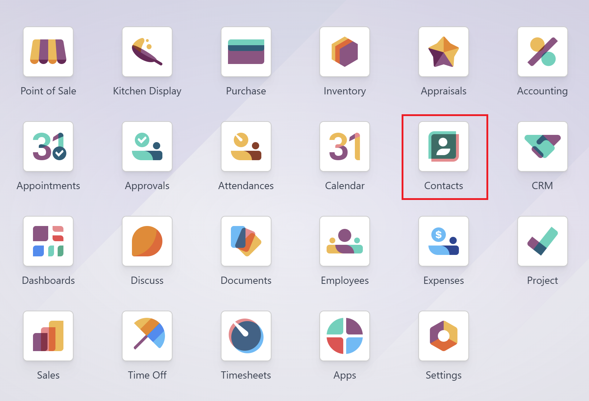
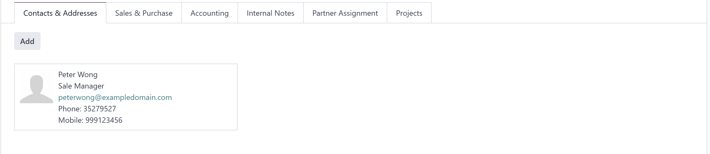

# USC Odoo User Guide - Create Contact  

## Overview  
Creating and managing contacts in Odoo is a crucial step in order processing, sales, and project management. This guide provides step-by-step instructions for adding new contacts, whether they are customers, vendors, or partners, ensuring accurate and complete information is captured.

---

## Prerequisite  

Before creating a contact, make sure you are logged into the Odoo system.  

[How to Log into Odoo](../getting-start/logging-into.md)

---

## Why Create Contacts in Odoo?  

- **Customer Management:** Keep track of customer details for sales and support.  
- **Vendor Management:** Maintain supplier information for purchase orders.  
- **Partner Relationships:** Store data on business partners, including billing and shipping addresses.  

---

## Step-by-Step Instructions  

### 1. Accessing the Contacts Module  

1. **Log into Odoo:** Ensure you are logged into the USC Odoo system.  
2. **Navigate to Contacts:**  
   - Click on the **Apps Menu** (grid icon) in the top navigation bar.  
   - Select **Contacts** from the list of available modules.  
 
  
*Figure 1: Selecting the Contacts module from the Odoo app menu.*  

---

### 1. Accessing the Contacts Module  

1. **Log into Odoo:** Ensure you are logged into the USC Odoo system.  
2. **Navigate to Contacts:**  
   - Click on the **Apps Menu** (grid icon) in the top navigation bar.  
   - Select **Contacts** from the list of available modules.  

  
*Figure 1: Selecting the Contacts module from the Odoo app menu.*  

---

### 2. Creating a New Contact  

1. **Click on New:** In the Contacts module, click the **New** button at the top left.  
    

2. **Fill in the Contact Details:**  
Below are detailed descriptions of each field, including the impact and effect of the data entered:  

| **Field Name**       | **Description**                                                 | **Impact / Effect**                                                     |
|----------------------|-----------------------------------------------------------------|------------------------------------------------------------------------|
| **Name**            | Full name of the contact (Individual or Company).                | Used in all sales, purchase, and communication records.                  |
| **Company Name**    | Associated company of the contact, if applicable.                | Links contact to the company for invoicing and CRM purposes.            |
| **Address**         | Street, city, state, zip code, and country information.          | Essential for deliveries, billing, and reporting based on location.     |
| **Phone Number**    | Primary phone contact of the individual or company.              | Displays on sales orders, purchase orders, and communications.          |
| **Mobile**          | Secondary contact method, typically for individuals.             | Useful for urgent or direct communications.                             |
| **Email**           | Contact’s email address.                                         | Used for sending quotations, invoices, and email communications.        |
| **Website**         | Company or personal website URL.                                 | Provides quick access for sales and support teams.                      |
| **Contact Type**    | Select **Individual** or **Company**.                            | Determines whether this contact acts as a person or an entity in Odoo.  |
| **Tags**            | Keywords to categorize the contact.                              | Improves searchability and helps in segmenting contacts.                 |
| **Internal Notes**  | Private notes visible only to internal users.                    | Useful for storing special instructions or private information.         |
| **Payment Terms**   | Default payment terms for this contact.                          | Automatically applies terms to sales and purchase orders.               |
| **Pricelist**       | Select a specific price list for this contact.                   | Defines product pricing when creating sales orders.                     |

  
*Figure 2: The Create Contact form with fields for personal and company information.*  

When creating a new contact in Odoo, there are multiple tabs available to manage detailed information about the contact. These tabs include **Contacts & Addresses**, **Sales & Purchase**, **Accounting**, **Internal Notes**, **Partner Assignment**, and **Projects**. Each tab serves a specific purpose and provides additional fields to capture relevant data.

---

#### **a. Contacts & Addresses Tab**  

The **Contacts & Addresses** tab is used to store primary and secondary contact details associated with a company or individual.  

**Key Elements:**  

- **Add Button:** Allows you to add multiple contacts to a single company record. This is useful for managing various points of contact within an organization, such as sales managers, purchasing agents, and support personnel.  
- **Contact Details Card:** Displays the information of added contacts, including:  
  - **Name:** The full name of the contact person.  
  - **Job Title:** The role of the contact within the company.  
  - **Email:** The primary email address for communication.  
  - **Phone:** The landline or office phone number.  
  - **Mobile:** The contact's mobile number for direct communication.  

  

*Figure 1: Adding multiple contacts under the Contacts & Addresses tab in Odoo.*

---

#### **b. Sales & Purchase Tab**  

The **Sales & Purchase** tab is where you define whether the contact is a customer, a vendor, or both.  

**Key Elements:**  
- **Customer Checkbox:** Enables the contact to be used in sales operations, such as quotations and sales orders.  
- **Vendor Checkbox:** Allows the contact to be selected when creating purchase orders.  
- **Payment Terms:** Default payment terms that apply automatically during transaction creation.  
- **Pricelist:** Select specific price lists for the contact, useful in sales and procurement scenarios.  

  

---

#### **c. Accounting Tab**  

The **Accounting** tab manages financial settings and integrations related to the contact. This tab is crucial for financial transactions but often does not require customization by standard office users.  

**Key Elements:**  

- **Receivable & Payable Accounts:**  
    - These fields define which accounts are used in journal entries involving this contact. 
 
    > **Important:** Do not modify these fields. Leave them as the default to avoid potential accounting discrepancies. Any changes should only be made by the accounting department or system administrator.  

- **Bank Account Details:**  
    - Store the bank account information for automatic payment processing if applicable.  
    - This is useful for vendor contacts when processing payments directly through Odoo.  

---

#### **d. Internal Notes Tab**  

The **Internal Notes** tab allows you to add notes that are visible only to internal users.  

**Key Elements:**  

- **Notes Field:** Free-text area for adding important information or reminders about the contact.  

---

#### **e. Partner Assignment Tab**  

The **Partner Assignment** tab is used to assign responsible users or salespersons to this contact.  

**Key Elements:**  

- **Salesperson:** Assigns a specific sales representative to manage interactions with this contact.  
- **Sales Team:** Defines which sales team is responsible for the contact.  

---

#### **f. Projects Tab**  

The **Projects** tab is particularly useful if the contact is involved in project-related activities.  

**Key Elements:**  

- **Project Management:** Link projects directly to the contact.  
- **Task Assignments:** Assign specific tasks under the related projects.  

---

### 4. Saving the Contact  

1. **Review All Information:** Ensure that all mandatory fields are filled out.  
2. **Click Save:** Once completed, click the **Save** button at the top of the form.  
3. **Verify the New Contact:** The contact will now appear in the list view and be available for use in modules like **CRM**, **Sales**, and **Purchase Orders**.  

---

## Best Practices  

- **Complete Information:** Always fill in as much information as possible to avoid issues during order processing.  
- **Use Tags:** Add relevant tags to contacts for easier searching and filtering.  
- **Regular Updates:** Review and update contact information periodically to maintain accuracy.  

---

## Troubleshooting  

### 1. Cannot Save the Contact  

- **Check Required Fields:** Make sure all mandatory fields are completed.  
- **Error Messages:** Read any error messages carefully to understand what might be missing.  

### 2. Duplicate Contact Warning  

- Odoo may alert you if a contact with the same name or email already exists.  
- Choose to either **Merge Contacts** or update the existing contact if needed.  

---

## IT Support Contact  

- **Email:** [ericmok@uscpower.net](mailto:ericmok@uscpower.net)  
- **Phone:** +852 6622 7663  

---

[<- Back to Index](../../user-guide.index.md)

