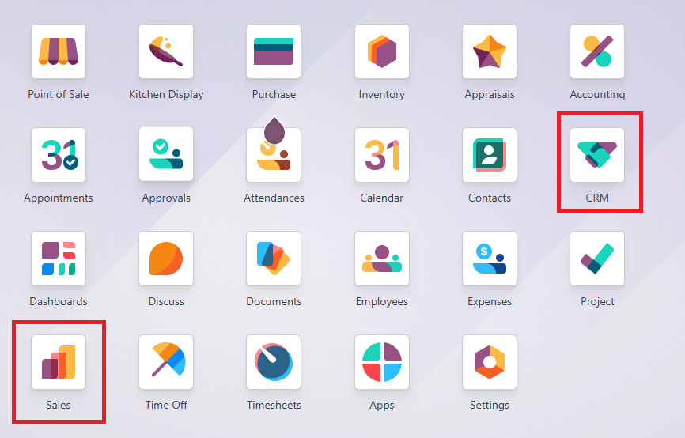
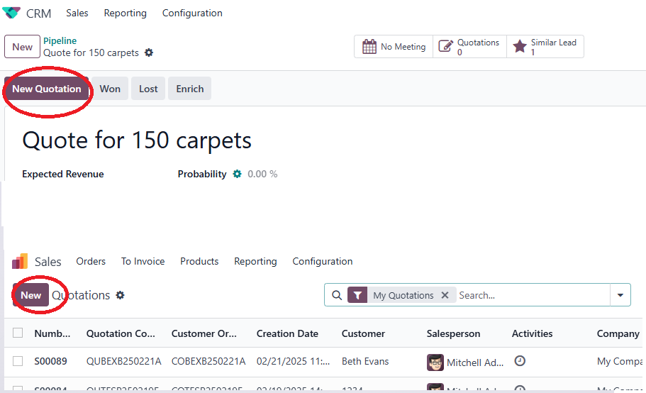

# USC Odoo User Guide - Create Quotation

## Overview
Creating a quotation in Odoo is a critical step in formalizing offers to clients based on approved cost sheets and validated opportunities. This guide provides a clear workflow for generating accurate and complete sales quotations while adhering to USC's internal guidelines.

---

## Prerequisite

Before creating a quotation, make sure you have completed the following steps:

- [Cost Sheet Preparation](./cost-sheet-management.md)
- [Manage Opportunities](./crm-opportunity.md)

Also, ensure you are logged into the Odoo system:

- [How to Log into Odoo](../getting-start/logging-into.md)

---

## Key Requirements

- **Add at Least One Product:** Every quotation must include at least one product or service.
- **Attach the Cost Sheet:** Upload the prepared and approved cost sheet to the quotation.
- **Customer Reference Field:** If applicable, enter the Customer PO Number or Tender Number in the customer reference field.
- **Approval Required:** Ensure the quotation is reviewed by either Steven or Jakin before sending it to the customer via email.

---

## Step-by-Step Instructions

### 1. Accessing the Sales Module

1. **Log into Odoo:** Ensure you are logged into the USC Odoo system.
2. **Navigate to Sales:**
   - Click on the **Apps Menu** (grid icon) in the top navigation bar.
   - Select **Sales** from the list of available modules.

📷 **Image Suggestion:** Screenshot showing the Sales module icon in the app menu.

---

### 2. Creating a New Quotation

1. **Click on Create:** In the Sales module, click the **Create** button to start a new quotation.

2. **Fill in Quotation Fields:**

| **Field Name**        | **Description**                                                   | **Impact / Effect**                                                          |
|-----------------------|-------------------------------------------------------------------|------------------------------------------------------------------------------|
| **Customer**          | Select the customer from the dropdown and choose the correct contact person. | Links the quotation to the appropriate customer record for future sales and invoicing. |
| **Customer Reference**| Enter the customer PO number or tender number if applicable.      | Helps match internal records with customer procurement documents.             |
| **Product**           | Add at least one product/service to the quotation.                | Ensures the quotation is valid and ready for pricing and approval.            |
| **Cost Sheet Attachment** | Upload the approved cost sheet in the attachment section.       | Any quotation without a cost sheet will be rejected.                          |
| **Quotation Date**    | Set the date of the quotation.                                    | Determines the start of the quotation validity period.                        |
| **Expiration Date**   | Define when the quotation expires.                                | Communicates the offer's validity to the customer.                            |
| **Payment Terms**     | Select the standard or specific payment terms for the customer.   | Automates payment conditions in the sales order if the quotation is accepted. |

📷 **Image Suggestion:** Screenshot of the Create Quotation form with all required fields highlighted.

#### 2.1 About Quotation Number

The quotation number will be generated automatically upon the quotation being saved. And the quotation number can be modified before it has been confirmed.  
The quotation number format `TTCCCBDDDDDDS-RN`    

- **`TT`**: The document type, 
    - `QU`: Quotation, 
    - `SO`: Sale Order, 
    - `PO`: Purchase Order, 
    - `DN`: Delivery Note, 
    - `IN`: Invoice.  
- **CCC**: The customer short code, defined in `Contact`.  
- **B**: The transation term, 
    - `B`: I + T + M = Bundle sale
    - `I`: Installation
    - `M`: Manntenance
    - `S`: Service  
    - `P`: Project Management
    - `T`: Trading  
    - `U`: Undefined
- **DDDDDD**: The date of creation   
- **S**: The sequential number is grouped by the creation date in English characters, where 1 = A, 2 = B, and so on.   
- **RN**: Only available when the document is revised. `-R` represents the fixed characters, and `N` is the number of revisions.  

---

### 3. Sending the Quotation via Email

1. **Review the Quotation:** Double-check all fields and attached documents.
2. **Approval Check:** Ensure the quotation is reviewed by Steven or Jakin before sending.
3. **Send via Email:**
   - Use Odoo's **Send by Email** feature to send the quotation directly to the customer.
   - Alternatively, download the quotation as a PDF and send it through your email client.
4. **Document the Sent Quotation:** Attach a copy of the sent email or save a PDF copy in Odoo for record-keeping.

---

## Best Practices

- **Ensure Accuracy:** Double-check all quotation details, including products, prices, and terms.
- **Follow Approval Protocols:** Do not send any quotation without prior review by the authorized personnel.
- **Maintain Records:** Keep all cost sheets and related documents attached to the quotation for auditing purposes.

---

## Troubleshooting

### 1. Cannot Submit Quotation
- **Missing Cost Sheet:** Attach the approved cost sheet before submission.
- **Product Not Added:** Ensure at least one product is listed in the quotation.
- **Approval Issues:** Confirm that the approver is either Steven or Jakin.

---

## IT Support Contact

- **Email:** [ericmok@uscpower.net](mailto:ericmok@uscpower.net)
- **Phone:** +852 6622 7663

---

[<- Back to Index](../../user-guide.index.md)

