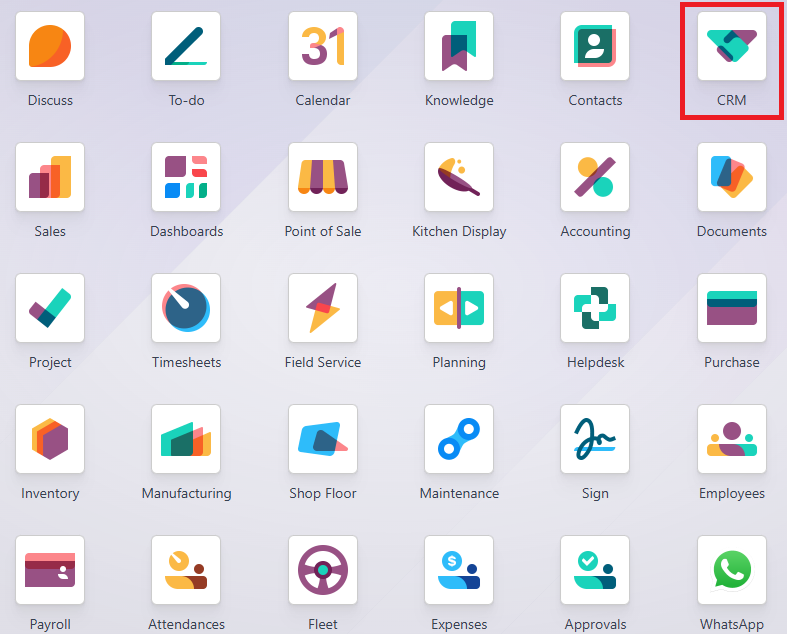
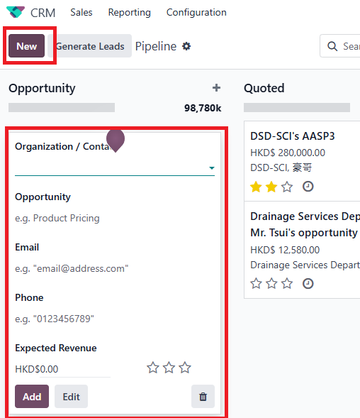
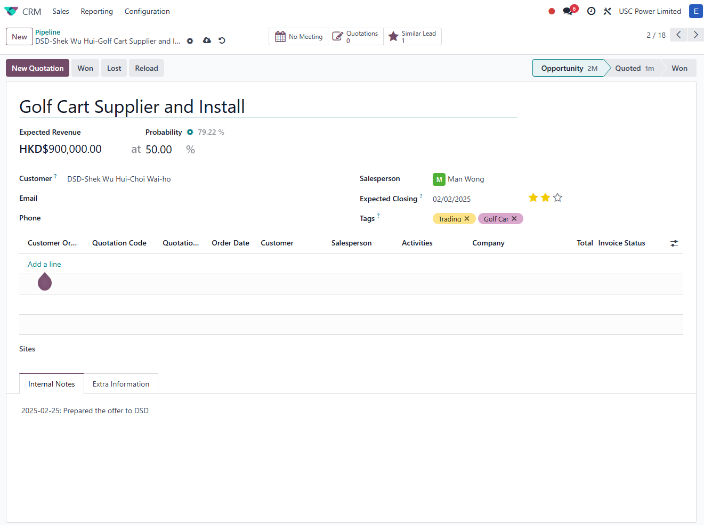
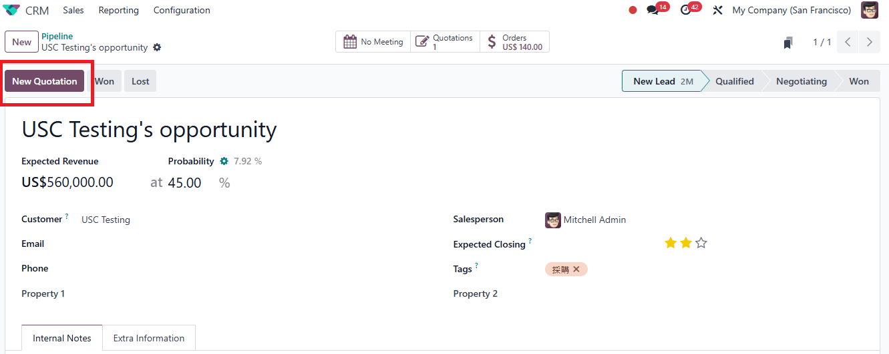
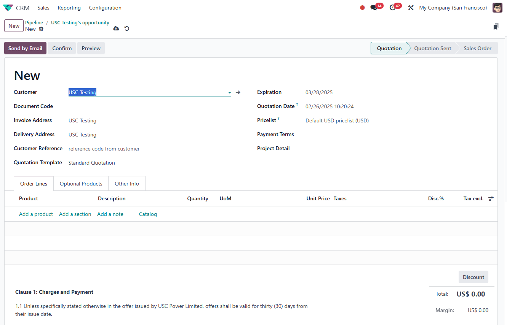

# USC Odoo User Guide - CRM Opportunity

## Overview
The **CRM Opportunity** module in Odoo is a powerful tool for managing sales opportunities, tracking customer interactions, and converting opportunities into quotations. This guide provides detailed instructions on how to effectively use the CRM module to maximize sales potential and maintain organized sales pipelines.

---

## Prerequisite

Before managing opportunities, make sure you are logged into the Odoo system.

[How to Log into Odoo](../getting-start/logging-into.md)

Also, ensure the customer contact is already created in the system.

[How to Create Contact](./create-contact.md)

---

## Why Use CRM Opportunity in Odoo?

- **Centralize Sales Management:** Organize all sales opportunities in a single platform.
- **Track Customer Interactions:** Maintain records of calls, emails, and meetings.
- **Streamline Quotation Process:** Easily convert opportunities into sales quotations.
- **Improve Sales Performance:** Analyze sales activities and monitor sales pipeline health.

---

## Step-by-Step Instructions

### 1. Accessing the CRM Module

1. **Log into Odoo:** Ensure you are logged into the USC Odoo system.
2. **Navigate to CRM:**
   - Click on the **Apps Menu** (grid icon) in the top navigation bar.
   - Select **CRM** from the list of available modules.

*Figure 1: Selecting the CRM module from the Odoo app menu.*

---

### 2. Creating a New Opportunity

1. **Click on Create:** In the CRM module, click the **Create** button at the top left.

2. **Fill in the Opportunity Details:**
   - **Opportunity Title:** Provide a clear and descriptive name for the opportunity, including the nature of the job, tender code, or any specific identifier to accurately describe the opportunity.
   - **Customer:** Select the relevant contact from the dropdown list and choose the appropriate person associated with the opportunity.
   - **Expected Revenue:** Enter the potential revenue amount associated with this opportunity.
   - **Probability (%):** Estimate the probability of winning this opportunity (e.g., 50%, 80%).
   - **Salesperson:** Assign the salesperson responsible for this opportunity.  
   - **Expected Closing**: Enter the expected closing date for the opportunity, considering the sales cycle and any deadlines related to the job or tender.
   - **Sales Team:** Specify the sales team managing this opportunity.
   - **Tags:** Add tags to categorize the opportunity (e.g., Urgent, High-Value).
   - **Next Activity:** Schedule the next step, such as a follow-up call or meeting.

*Figure 2: The Create Opportunity form with fields for opportunity management.*

---

### 3. Managing Opportunities

At USC, it is essential to manage opportunities consistently to maintain an accurate sales pipeline. All possible opportunities should be added to the system, even if they are just initial inquiries.

**Swim-lane Management:**
- **Opportunities:** Include all potential leads, even those that are just enquiries. Keep all opportunities visible in this swim-lane until a quotation or tender is sent.
- **Quoted:** Move opportunities to this stage once a formal quotation or tender has been sent to the customer.
- **Won:** Opportunities should be moved to this stage only when the order has been confirmed and secured.

**How to Manage Opportunities:**
1. **Kanban View:** Use the drag-and-drop feature to move opportunities between different stages (Opportunities, Quoted, Won).
2. **Schedule Activities:** Add activities like calls, meetings, or tasks to keep track of interactions with the customer.
3. **Log Activities:** Record completed activities, including notes from customer interactions.
4. **Update Opportunity Status:** Manually update the status of the opportunity to reflect the sales progress.

**Example:**

*Figure 3: Managing opportunities in the CRM module using Kanban view.*

---

### 4. Converting Opportunities to Quotations

1. **Select Opportunity:** Open the opportunity that is ready for conversion.
2. **Click on Convert to Quotation:** Use the action button to generate a sales quotation directly from the opportunity.
3. **Complete the Quotation Form:** Ensure all necessary fields are filled, including products, pricing, and terms. *[Refer to Quotation Management](./quotation-management.md)*
4. **Submit for Approval:** If approval is required, follow the company's approval workflow.

> for the detail of quotation management, please refer to *[Quotation Management](./quotation-management.md)*

*Figure 4: Converting an opportunity into a sales quotation.*

---

## Best Practices

- **Regular Updates:** Keep the status of opportunities updated to avoid outdated information.
- **Use Tags Wisely:** Help categorize opportunities for better filtering and reporting.
- **Follow Up on Activities:** Ensure scheduled activities are completed and logged properly.

---

## Troubleshooting

### 1. Unable to Save Opportunity

- **Check Required Fields:** Make sure all mandatory fields are completed.
- **Error Messages:** Read any error messages carefully to understand what might be missing.

### 2. Duplicate Opportunity Warning

- Odoo may alert you if an opportunity with the same name or customer already exists.
- Choose to either **Merge Opportunities** or update the existing opportunity if needed.

---

## IT Support Contact

- **Email:** [ericmok@uscpower.net](mailto:ericmok@uscpower.net)
- **Phone:** +852 6622 7663

---

[<- Back to Index](../../user-guide.index.md)

