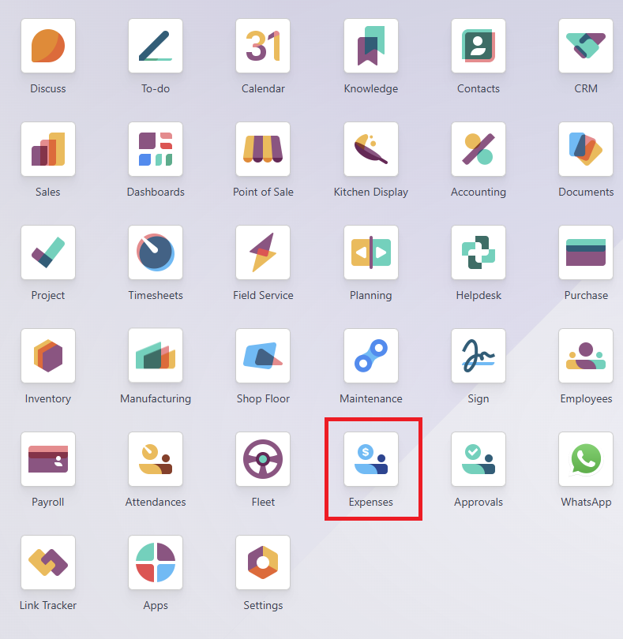
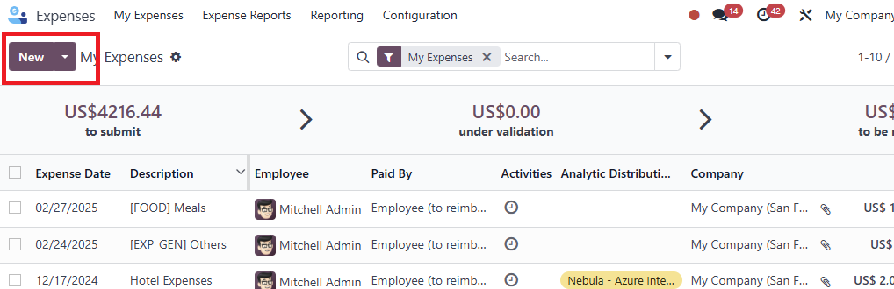
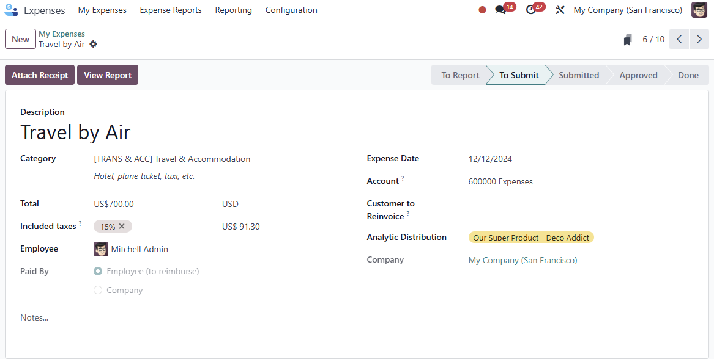
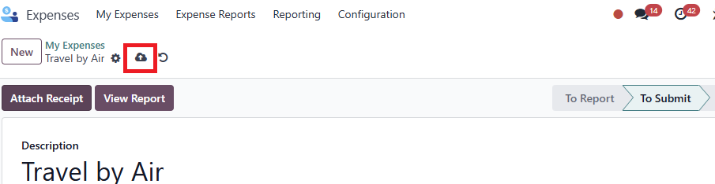
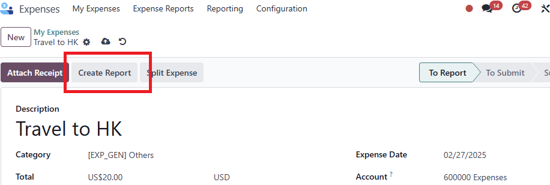
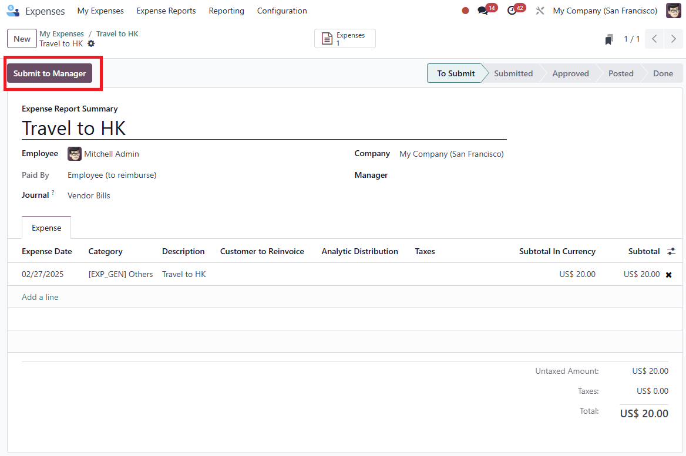
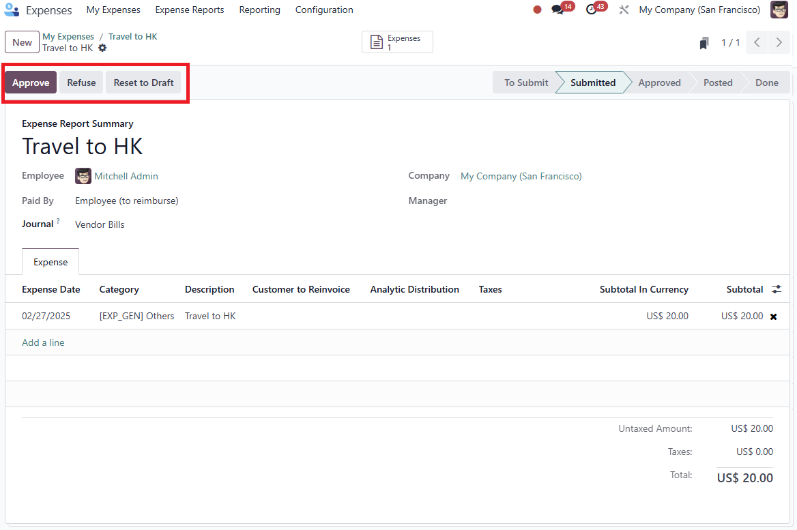
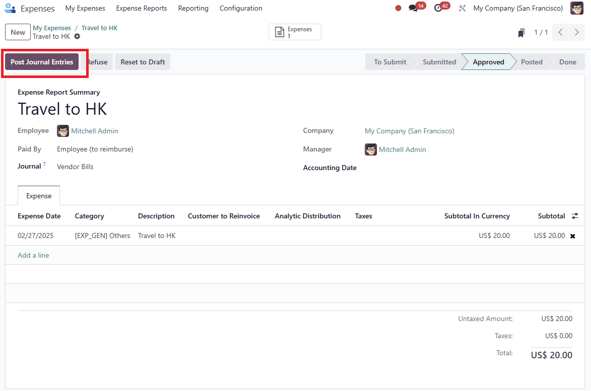
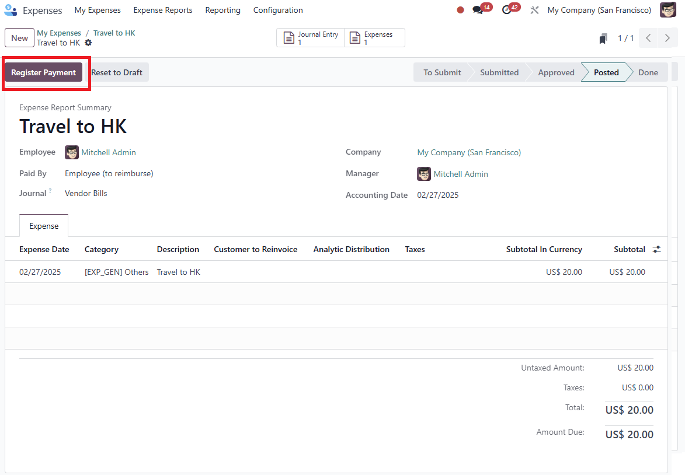

# USC Odoo User Guide - Expenses for Sales Orders

## Overview

Managing expenses related to sales orders in Odoo is crucial for maintaining accurate project cost tracking and financial transparency. This guide outlines the process for adding expenses to sales orders, explains the importance of binding expenses to the correct sales order, and provides best practices for efficient expense management.

---

## Prerequisite

Before managing expenses, make sure you have completed the following steps:

- [Sales Order Management](./sale-order-management.md)
- [Project Management](./project-management.md)

Also, ensure you are logged into the Odoo system:

- [How to Log into Odoo](../getting-start/logging-into.md)

---

## Why Adding Expenses to Sales Orders is Important

- **Accurate Project Costing:** Associating expenses with the correct sales order ensures that project budgets are tracked accurately.
- **Financial Reporting:** Helps in generating precise profit and loss statements for each sales order.
- **Invoicing and Reimbursements:** Expenses linked to sales orders can be included in customer invoices or internal reimbursement processes.
- **Resource Management:** Provides insights into the cost of labor, materials, and other project-related expenditures.
- **Comparison with Cost Sheet:** Maintains a complete record of actual costs to compare against the estimated costs in the cost sheet, supporting project analysis and future budgeting.

---

## Step-by-Step Instructions

### 1. **Steps to Manage Expenses in Sales Orders**

1. **Go to Expenses Module:**
      - Log into Odoo and navigate to the **Expenses** module.
      

2. **Create Expense:**
      - Click **New** to initiate a new expense record.
      

4. **Fill the Expense Form:**        
      - **Pick correct expense type:** Select the appropriate expense category.
      - **Adding Expense to Sales Order (If Applicable):** Use the **Sales Order (SO)** dropdown list to link the expense to the correct sales order.
      - **Fill the Expense Form:** Enter all required fields, including **Amount** and **Attach a Receipt**.  
      
      
5. **Save the Expense:**
      - Click **Save** to ensure the expense details are recorded.  
      

6. **Create Expense Report:**
      - Generate an expense report to bundle individual expenses for submission.  
      

7. **Submit to Manager:**
      - Submit the expense report to the manager for approval.  
      

8. **Manager Approval:**
      - The manager reviews and approves the expense report in Odoo.  
      

9. **Post Journal Entries by Accounting Department:**
      - Once approved, the accounting department posts the journal entries for accurate financial tracking.  
      

10. **Register Payment by Accounting Department:**
      - The accounting team processes the payment and registers it in Odoo.  
      

11.  **Expense Status - Done:**
        - After payment is completed, the expense status changes to **Done**, finalizing the process.

---

## Managing Expenses

- **Regularly Review Expenses:** Ensure that all expenses are correctly attributed to sales orders.
- **Maintain Supporting Documents:** Attach receipts, invoices, and other supporting files to expense records in Odoo.
- **Monitor Budget Impact:** Check how expenses affect the overall budget and profitability of the sales order.

---

## Best Practices

- **Always Bind Expenses to a Sales Order:** Never leave the sales order field blank when adding expenses.
- **Classify Expenses Accurately:** Use appropriate categories (e.g., **Material**, **Labor**, **Logistics**) to improve financial reporting.
- **Keep Detailed Records:** Attach receipts and maintain proper documentation for all expenses.

---

## Troubleshooting

### 1. Expense Not Linked to Sales Order

- **Check Sales Order Binding:** Make sure the sales order is selected in the expense entry.
- **Review Permissions:** Ensure you have access rights to bind expenses to the selected sales order.

### 2. Incorrect Expense Classification

- **Edit Expense Entry:** Correct the classification by choosing the appropriate expense type.
- **Update Financial Reports:** Re-run reports if necessary to reflect the updated expense data.

---

## IT Support Contact

- **Email:** [ericmok@uscpower.net](mailto:ericmok@uscpower.net)
- **Phone:** +852 6622 7663

---

[<- Back to Index](../../user-guide.index.md)

