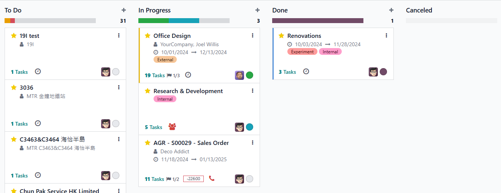

# USC Odoo User Guide - Project Management

## Overview

Project management in Odoo is an integral part of executing sales orders, especially for service-based products and projects requiring milestone-based invoicing. This guide covers both automatic and manual project creation, task management, and best practices for ensuring accurate timesheet tracking and cost calculation.

---

## Prerequisite

Before managing projects, make sure you have completed the following steps:

- [Convert Quotation to Sales Order](./convert-quotation.md)

Also, ensure you are logged into the Odoo system:

- [How to Log into Odoo](../getting-start/logging-into.md)

---

## Project Creation Methods

### 1. **Automatic Project Creation**

Projects can be created automatically when specific products in the sales order are configured with:

- **Project Template:** Odoo will generate a new project based on the selected template.
- **Task Template:** Tasks will be pre-created within the project according to the task template settings and the product line will become the task title.

### 2. **Manual Project Creation**

If a project is not automatically created, you can manually create one by:

- **Navigating to the Project Module:**
    - Click **Create** to start a new project.
    - Fill in all necessary project details, including **Customer**, **Project Name**, and **Expected Start and End Dates**.
- **Add Tasks Manually:** You can manually add tasks as needed, defining the scope and responsibilities.
- **Bind to SO**: Bind the project to the related Sales Order (SO) for accurate project and financial tracking.

---

## Task Management

1. **Assign Workers to Tasks**

      - Assign responsible workers to tasks to enable timesheet logging and accurate cost calculation.
      - Ensure each task has clear start and end dates.

2. **Complete Tasks**

      - Move tasks to the **Completed** stage once they are done.
      - This updates the project progress and prepares for potential milestone invoicing.

3. **Plan Dates Effectively**

      - Always fill in the **Planned Start** and **Planned End** dates to ensure project timelines are tracked properly.

  
*Task Assignee*

  
*Project Status*

  
*Task Status*  

---

## Timesheet Tracking and Cost Calculation

- **Timesheet Entry:** Workers assigned to tasks can log their work hours directly through the WeChat Mini App module timesheet module (available shortly).
- **Cost Calculation:** The timesheet data integrates with project costs, allowing accurate labor cost reporting.

---

## Best Practices

- **Utilize Project and Task Templates:** Automate repetitive tasks and standardize project setups.
- **Regularly Update Task Status:** Keep task progress up to date to avoid project delays.
- **Monitor Timesheet Accuracy:** Review timesheets regularly to ensure correct cost allocations.

---

## Troubleshooting

### 1. Project Not Created Automatically

- **Check Product Settings:** Ensure the product in the sales order is linked to a project and task template.
- **Manually Create Project:** Follow the manual creation steps if automation fails.

### 2. Task Status Not Updating

- **Review Task Assignments:** Make sure the assigned worker is updating the task status.
- **Check Permissions:** Ensure workers have the correct permissions to modify task statuses.

---

## IT Support Contact

- **Email:** [ericmok@uscpower.net](mailto\:ericmok@uscpower.net)
- **Phone:** +852 6622 7663

---

[<- Back to Index](../../user-guide.index.md)

