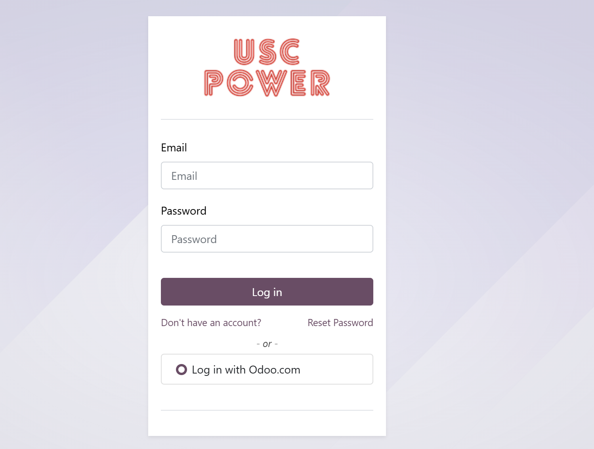
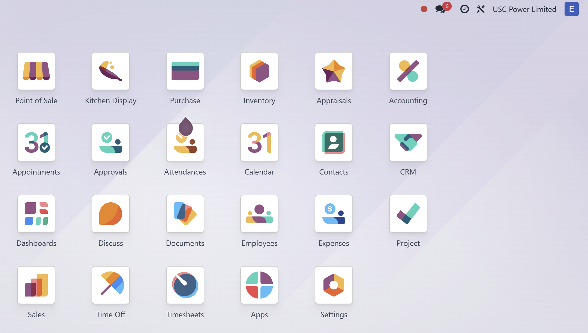

# USC Odoo User Guide - Logging Into the System  

## Overview  
This guide provides step-by-step instructions for office users on how to log into the USC Odoo system. Ensuring proper login is the first step in accessing all the features required for order management, sales processing, and project management.

---

## Prerequisites  
Before logging into the Odoo system, make sure you have the following:  

- A valid **Username** and **Password** provided by the IT department.  
- Access to the internet if logging in from outside the office.  
- A compatible web browser (e.g., Google Chrome, Microsoft Edge, Mozilla Firefox).  

---

## Step-by-Step Login Instructions  

### 1. Open the Odoo System  

1. **Open your web browser** and navigate to the USC Odoo system URL:  
   **[https://odoo.uscpower.net](https://odoo.uscpower.net)**  

2. You should see the Odoo login page as shown below:  

     

---

### 2. Enter Your Login Credentials  

1. **Username:** Enter your USC-provided email address (e.g., `yourname@usc.com`).  
2. **Password:** Enter the password provided by the IT department.  
3. Click the **Login** button.  

📌 **Tip:** Ensure that there are no extra spaces before or after your username and password.  

---

### 3. Two-Factor Authentication (If Applicable)  

1. If two-factor authentication (2FA) is enabled, you will be prompted to enter a verification code:  
   - Open your authentication app (e.g., Google Authenticator or Microsoft Authenticator).  
   - Enter the code displayed in the app into the verification field on the Odoo login page.  
2. Click **Verify** to proceed.  

---

### 4. Successful Login  

1. Upon successful login, you will be directed to the Odoo **Dashboard**.  
2. The dashboard provides access to all authorized modules such as **Sales**, **CRM**, **Projects**, **Timesheets**, and **Purchase Orders**.  

---

## Troubleshooting  

### 1. Forgot Password  

- If you cannot remember your password:  
  1. Click on **Forgot Password?** on the login page.  
  2. Enter your email address and follow the instructions sent to your email to reset your password.  

### 2. Invalid Username or Password  

- Double-check for any typos in your username and password.  
- Make sure the **Caps Lock** is not turned on.  
- If the problem persists, contact the IT support team.  

### 3. Unable to Access the Login Page  

- Check your internet connection.  
- Clear your browser's cache and cookies.  
- Try accessing the page in an **Incognito** or **Private** browser window.  

---

## IT Support Contact  

- **Email:** [ericmok@uscpower.net](mailto:ericmok@uscpower.net)  
- **Phone:** +852 66227663  

[<- Back to Index](../../../index.md)