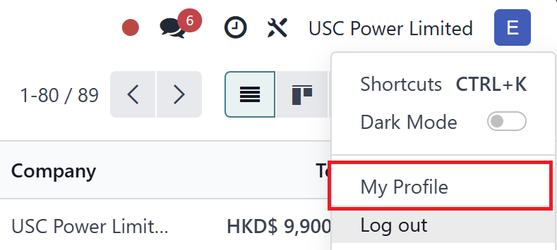
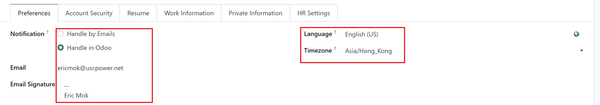
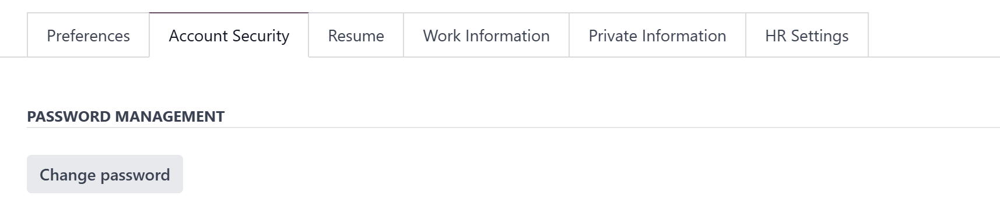
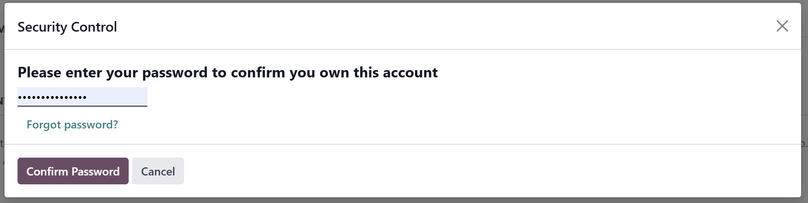

# USC Odoo User Guide - User Profile and Preferences  

## Overview  
The User Profile and Preferences section in Odoo allows you to personalize your settings, update your information, and configure notifications. Keeping your profile up to date ensures effective communication and a personalized experience within the system.

---

## Key Features of the User Profile  

### 1. Accessing Your User Profile  

1. [**Log into Odoo:**](./logging-into.md) Ensure you are logged into the USC Odoo system.  
2. **Open the User Menu:** Click on your profile icon located at the top-right corner of the screen.  
3. **Select My Profile:** This will take you to the profile settings page.  

 
*Figure 1: Accessing the user profile from the top navigation bar.*  

---

### 2. Updating Your Personal Information  

1. **Edit Profile:** Click the **Edit** button on your profile page.  
2. **Update Details:** You can update the following fields:  
   - **Name:** Your display name in Odoo.  
   - **Email:** Your contact email.  
   - **Phone Number:** If applicable.  
   - **Job Title:** Update if your role within the company changes.  
3. **Save Changes:** Once updated, click **Save** to apply changes.  

  
*Figure 2: Editable fields in the user profile section.*  

---

### 3. Setting Preferences  

1. **Navigate to Preferences:** On the same profile page, click the **Preferences** tab.  
2. **Configure Settings:** You can modify:  
   - **Language:** Select your preferred display language.  
   - **Time Zone:** Ensure your time zone is set to **GMT +8** (Hong Kong).  
   - **Notifications:** Choose between email and in-app notifications.  
   - **Default Application:** Set the default app to open when you log in.  
3. **Apply Changes:** Click **Save** to finalize your preferences.  

  
*Figure 3: Configuring language, time zone, and notification settings.*  

---

### 4. Changing Your Password  

1. **Open Change Password:** From the profile menu, select **Change Password**.  
2. **Enter Your Current Password:** Required for security verification.  
3. **Set a New Password:** Follow the password policy (e.g., minimum 8 characters, include a number and a symbol).  
4. **Confirm and Save:** Click **Change Password** to apply the update.  

  
  
*Figure 4: Interface for updating your password securely.*  

---

## Best Practices  

- **Keep Information Updated:** Regularly review and update your profile to ensure all information is current.  
- **Set Correct Time Zone:** This is crucial for meeting schedules, project timelines, and reporting accuracy.  
- **Enable Notifications:** Stay informed by setting your preferred notification method (email or in-app).  

---

## Troubleshooting  

### 1. Unable to Save Profile Changes  

- **Check Required Fields:** Ensure all mandatory fields are filled.  
- **Clear Browser Cache:** If changes are not reflected, try clearing your cache or using an incognito window.  

### 2. Forgot Password  

- Use the **Forgot Password** link on the login page or contact IT support for assistance.  

---

## IT Support Contact  

- **Email:** [ericmok@uscpower.net](mailto:ericmok@uscpower.net)  
- **Phone:** +852 6622 7663  

---

[<- Back to Index](../../../index.md)  
