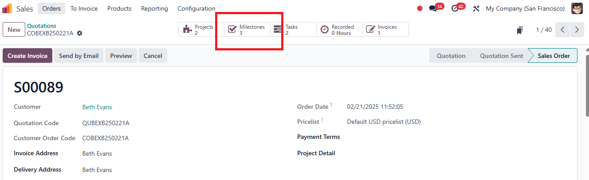
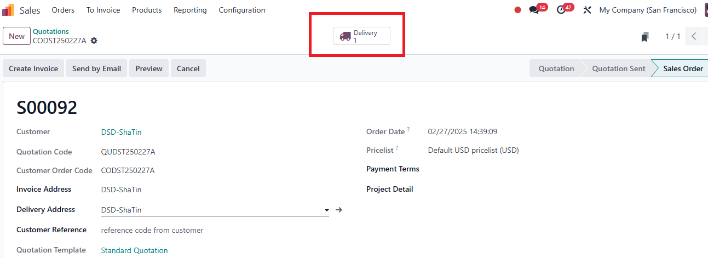

# USC Odoo User Guide - Milestone and Delivery Management

## Overview
Milestone and delivery management in Odoo ensures that projects and sales orders are executed according to planned phases and delivery schedules. This guide covers how milestones become available in sales orders, methods to add milestones, their importance in invoicing, how completion percentages are calculated for tasks, projects, and milestones, and managing product deliveries.

---

## Prerequisite

Before managing milestones and deliveries, make sure you have completed the following steps:

- [Project Management](./project-management.md)

Also, ensure you are logged into the Odoo system:

- [How to Log into Odoo](../getting-start/logging-into.md)

---

## How Milestones Are Available in Sales Orders

Milestones in Odoo are closely linked to the **product invoicing policy** and **project management settings**:

- **Product Invoicing Policy - Milestone:** When a product's invoicing policy is set to **Milestone**, Odoo will enable milestone tracking in the associated sales order.
- **Manual Addition:** Milestones can also be added manually to the project or sales order if needed.

---

## Ways to Add Milestones

### 1. **From the Milestone Interface**

1. **Navigate to the Project Module:**
      - Open the relevant project linked to the sales order.
      - Go to the **Milestones** tab and click **Create** to add a new milestone.

2. **Define Milestone Details:**
      - Provide a descriptive title, expected completion date, and any specific requirements.

*Setup milestone from project*

### 2. **From the Project Management Interface**

1. **Access the Project:**
   - Within the project, go to **Tasks**.
   - You can convert specific tasks into milestones by setting the invoicing policy or linking them to milestone-based billing.

2. **Linking Tasks to Milestones:**
   - Tasks completed within the milestone scope contribute to milestone completion percentage.

  
*Milestone entry-point in sale order*  

  
*Milestone list*

---

## Importance of Milestones and Invoicing Relationship

- **Milestone-Based Invoicing:**
     - When milestones are achieved, Odoo allows partial invoicing based on completed milestones.
     - This is particularly useful for long-term projects where payments are scheduled according to project progress.

- **Financial Impact:**
     - Ensures cash flow aligns with project progress and minimizes financial risks.
     - Helps in managing customer expectations by linking deliverables to payment schedules.

---

## Completion Percentage of Tasks, Projects, and Milestones

- **Task Completion:**
     - Mark tasks as **Completed** when done. Task progress contributes to the completion percentage of the associated project and milestone.

- **Milestone Completion:**
     - The milestone completion percentage is calculated based on the completion of tasks linked to the milestone.
     - Example: If a milestone consists of 4 tasks, completing 2 tasks will set the milestone to 50% completion.

- **Project Completion:**
     - Overall project completion is an aggregation of completed milestones and tasks, offering a clear view of project status.

---

## Delivery Management

### How Delivery Orders Are Generated

- **Automatic Delivery Creation:**
     - Delivery orders are generated automatically for stockable products included in a sales order.
     - The delivery process is linked to the warehouse and inventory management modules in Odoo.

- **Manual Delivery Management:**
     - If delivery is not generated automatically, you can manually create a delivery order by navigating to the **Inventory Module** and selecting **Create Delivery Order**.

### Managing Deliveries

1. **Prepare Products for Delivery:**
      - Ensure all products are available in inventory.
      - Pick, pack, and prepare goods according to the delivery order.

2. **Validate the Delivery:**
      - Mark the delivery as **Done** once products have been shipped or delivered to the customer.
      - This step is essential for updating stock levels and triggering invoicing if the invoicing policy is set to **Delivered Quantities**.

  
*Entry point of Delivery*  

  
*Delivery details: Adjust the quantity of items inline if split delivery is required. Check Availablity and Validate to complete the deliver*

---

## Best Practices

- **Define Clear Milestones:** Break down projects into logical milestones that align with invoicing policies.
- **Regularly Update Task Status:** Keep tasks updated to reflect accurate milestone and project completion percentages.
- **Align Milestones with Billing Schedules:** Ensure milestone completion triggers invoicing to maintain healthy cash flow.
- **Efficient Delivery Management:** Coordinate with warehouse staff to ensure timely and accurate deliveries.

---

## Troubleshooting

### 1. Milestones Not Showing in Sales Order

- **Check Product Invoicing Policy:** Make sure the product is set to **Milestone** invoicing.
- **Verify Project Template Settings:** Ensure milestones are included in the project template linked to the product.

### 2. Incorrect Completion Percentage

- **Review Task Statuses:** Confirm that all completed tasks are marked correctly.
- **Update Project Milestones:** Manually refresh milestones if automated tracking does not update.

### 3. Delivery Issues

- **Stock Not Available:** Verify inventory levels for the products in the delivery order.
- **Delivery Not Marked as Done:** Ensure the delivery process is completed in Odoo to update stock levels and trigger invoicing.

---

## IT Support Contact

- **Email:** [ericmok@uscpower.net](mailto:ericmok@uscpower.net)
- **Phone:** +852 6622 7663

---

[<- Back to Index](../../../index.md)

