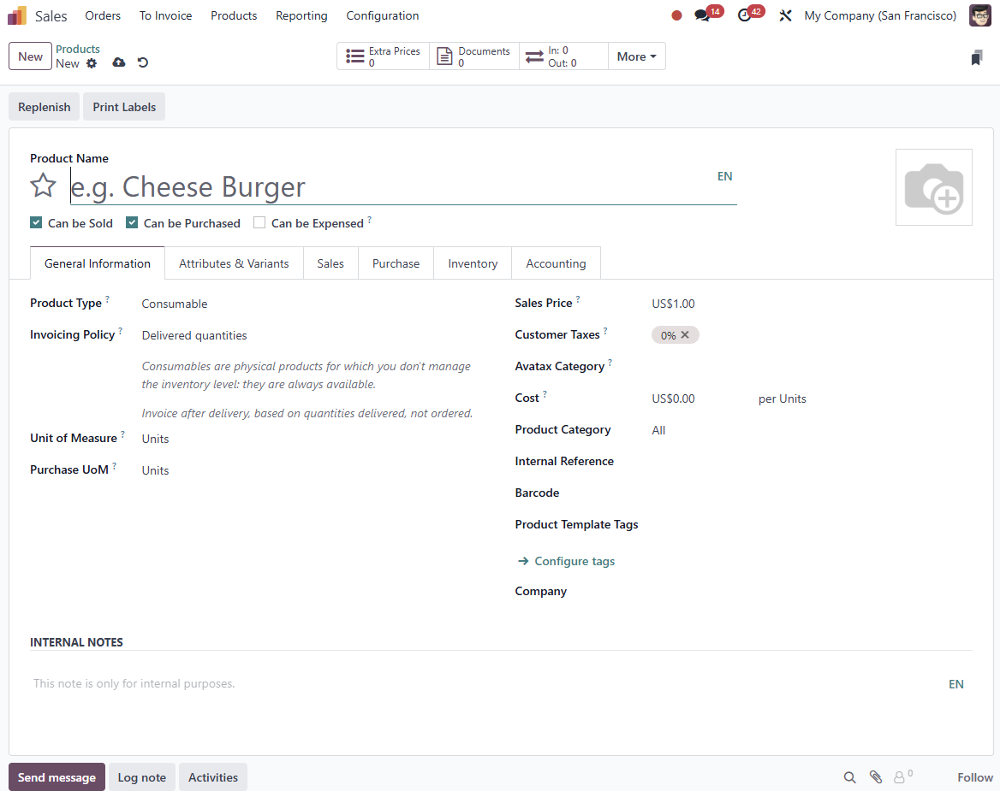

# USC Odoo User Guide - Product Management

## Overview
The Product Management module in Odoo is a central hub for creating and managing products used across sales orders, projects, and inventory. It is essential to configure products correctly, especially regarding product type and invoicing policy, to ensure smooth operations and accurate financial management.

---

## Prerequisite

Before managing products, make sure you have completed the following steps:

- [Sales Order Management](./sale-order-management.md)
- [Project Management](./project-management.md)

Also, ensure you are logged into the Odoo system:

- [How to Log into Odoo](../getting-start/logging-into.md)

---

## Key Points

- **Who Can Create Products:** Currently, only the **Accounting Department** is authorized to create new products in Odoo.
- **Importance of Correct Configuration:** The selection of the correct **Product Type** and **Invoicing Policy** has a significant impact on downstream processes such as sales order management, project automation, and invoicing.

---

## Step-by-Step Instructions to Create a Product

1. **Navigate to the Products Module:**
      - Go to **Sales** or **Inventory** module and select **Products**.

2. **Create a New Product:**
      - Click **Create** and enter the basic product details, including **Product Name**, **Internal Reference**, and **Product Category**.

3. **Select the Product Type:**
      - Choose the correct **Product Type** based on the intended use (e.g., **Service**, **Stockable Product**, **Consumable**).

4. **Set the Invoicing Policy:**
      - Define how the product will be invoiced (e.g., **Milestone**, **Timesheet-Based**, **Delivered Quantities**, **Ordered Quantities**).

5. **Save the Product:**
      - Ensure all information is correct and click **Save**.

  
*Product Creation Form*

---

## Field Descriptions and Impact

| **Field Name**        | **Description**                                                   | **Impact / Effect**                                                          |
|-----------------------|-------------------------------------------------------------------|------------------------------------------------------------------------------|
| **Product Name**      | The name of the product/service.                                 | Visible in sales orders, invoices, and inventory records.                     |
| **Internal Reference**| Unique code for internal identification.                         | Helps in quick search and reporting.                                          |
| **Product Type**      | Defines if the product is a service, stockable item, or consumable. | Influences inventory management, project automation, and delivery processes.  |
| **Invoicing Policy**  | Determines how and when the product is invoiced.                 | Affects billing, milestone tracking, and revenue recognition.                  |
| **Sales Price**       | Sets the default price for sales orders.                         | Impacts revenue generation and profit calculations.                           |
| **Cost**              | The cost of the product/service.                                 | Used in profitability analysis and cost sheet preparation.                     |
| **Category**          | Organizes products into groups for easier management.            | Supports better inventory and sales reporting.                                |
| **Project Template**  | Link to a project template if applicable.                        | Automates project creation when the product is sold.                          |

---

## Product Types and Their Differences

1. **Service:**  
      - Does not affect inventory.
      - Often linked to projects and timesheet-based invoicing.
      - Suitable for labor, consulting, and professional services.

2. **Stockable Product:**  
      - Requires inventory management and stock tracking.
      - Generates delivery orders when sold.
      - Ideal for physical goods and materials.

3. **Consumable:**  
      - Treated as available when needed, without strict stock tracking.
      - Commonly used for office supplies and low-value materials.

---

## Invoicing Policies and Their Impact

1. **Milestone:**  
      - Invoices are generated based on completed project milestones.
      - Suitable for long-term projects with staged payments.

2. **Timesheet-Based:**
      - Billing is driven by timesheet entries, often used for service-based products.
      - Useful for professional services and consulting.

3. **Delivered Quantities:**
      - Invoices are issued when products are delivered.
      - Typically used for physical goods that require delivery.

4. **Ordered Quantities:**
      - Allows immediate invoicing upon sales order confirmation.
      - Ideal for products or services that do not need delivery tracking.

---

## Best Practices

- **Always Verify Product Type:** Before saving, double-check the product type setting.
- **Align Invoicing Policy with Project Needs:** Ensure the invoicing policy matches the billing requirements of the sales order.
- **Maintain Consistent Naming Conventions:** Use standard names and internal references for easier reporting.

---

## Troubleshooting

### 1. Incorrect Product Type Selected

- **Review Product Configuration:** Navigate to the product settings and update the **Product Type** if needed.
- **Impact on Existing Sales Orders:** Changes to the product type may affect open sales orders and projects.

### 2. Wrong Invoicing Policy Configured

- **Edit the Product:** Correct the invoicing policy by selecting the appropriate option.
- **Update Affected Sales Orders:** Recalculate sales orders and invoices if the policy change impacts billing.

---

## IT Support Contact

- **Email:** [ericmok@uscpower.net](mailto:ericmok@uscpower.net)
- **Phone:** +852 6622 7663

---

[<- Back to Index](../../../index.md)

