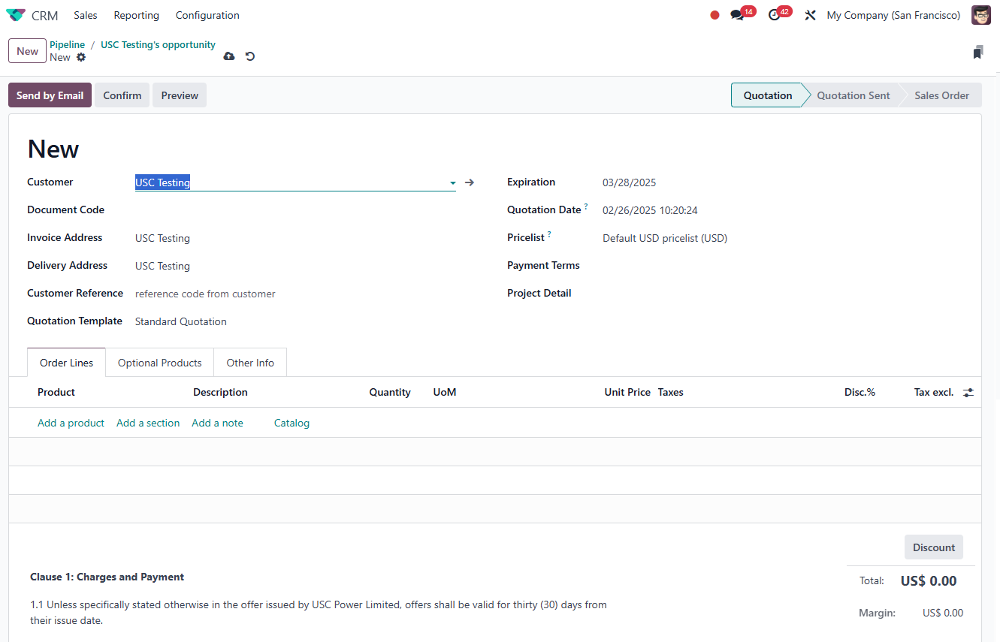

# USC Odoo User Guide - Quotation Management

## Overview
The **Quotation Management** process in Odoo involves preparing cost sheets, creating quotations, and ensuring proper approval workflows are followed before sending quotations to clients. This section outlines the step-by-step process, company-specific rules, and approval requirements for managing quotations efficiently.

---

## Prerequisite

Before creating a quotation, make sure you have completed the following steps:

- [How to Create Contact](./create-contact.md)
- [How to Manage Opportunities](./crm-opportunity.md)

Also, ensure you are logged into the Odoo system:

- [How to Log into Odoo](../getting-start/logging-into.md)

---

## Quotation Management Flow

The quotation management process at USC involves the following key stages:

1. **[Cost Sheet Preparation](./cost-sheet-management.md)**  
      - Complete the required cost sheet before creating a quotation.
      - Follow the designated cost sheet format (to be provided separately).          

2. **[Create Quotation](./create-quotation.md)**  
      - Generate a sales quotation using the approved cost sheet data.
      - Ensure all necessary information is accurately filled in, including customer details, pricing, and terms.          

3. **[Quotation Approval](./quotation-approval.md)**  
      - All quotations require approval before they can be sent to the customer.
      - Only **Steven** and **Jakin** have the authority to approve quotations.
      - The approval process ensures compliance with company pricing and sales policies.  
        
4. **Send Quotation**  
      - Once approved, the quotation can be sent to the customer through Odoo's built-in email or document sharing features.
      - Under no circumstances should a quotation be sent without proper approval.  
        

---

## Company Rules for Quotation Management

- **Cost Sheet Requirement:** A cost sheet is mandatory for all quotations. Ensure the cost sheet is complete and follows the standard format.
- **Approval Required:** Quotations cannot be sent to clients without approval.
- **Authorized Approvers:** Only **Steven** and **Jakin** can approve quotations.
- **Compliance:** All quotations must comply with company policies on pricing, terms, and sales strategy.

---

## Best Practices

- **Accuracy in Cost Sheets:** Double-check cost sheets to avoid pricing errors.
- **Timely Approvals:** Follow up with approvers (Steven and Jakin) to avoid delays in sending quotations.
- **Document Management:** Keep records of approved quotations for future reference and audit purposes.

---

## Troubleshooting

### 1. Unable to Submit Quotation for Approval

- **Check Cost Sheet:** Ensure the cost sheet is completed and attached.
- **Approval Permissions:** Verify that the approver is either Steven or Jakin.
- **System Errors:** If Odoo displays an error, try refreshing the page or contacting IT support.

---

## IT Support Contact

- **Email:** [ericmok@uscpower.net](mailto:ericmok@uscpower.net)
- **Phone:** +852 6622 7663

---

[<- Back to Index](../../../index.md)

