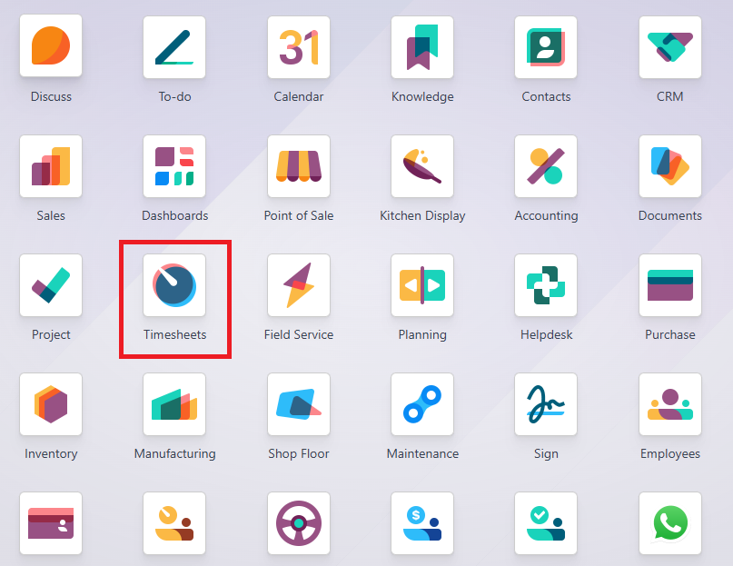
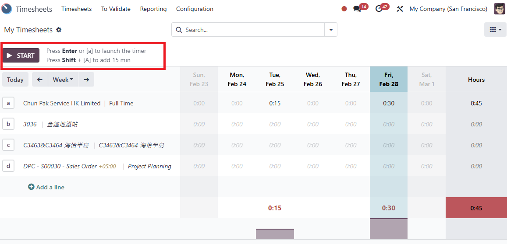
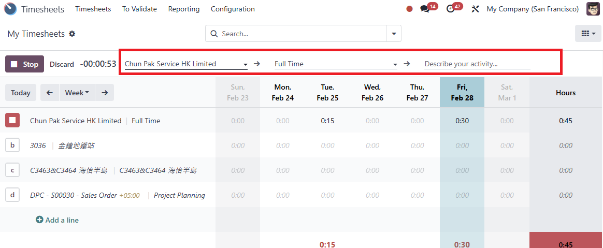
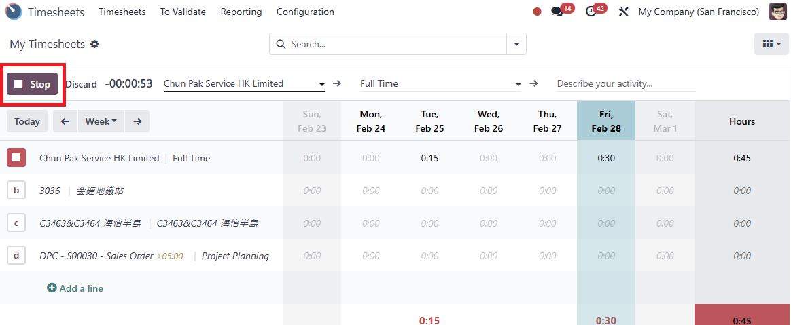
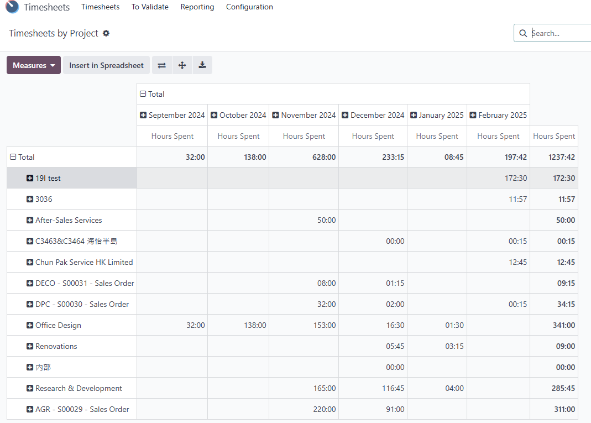
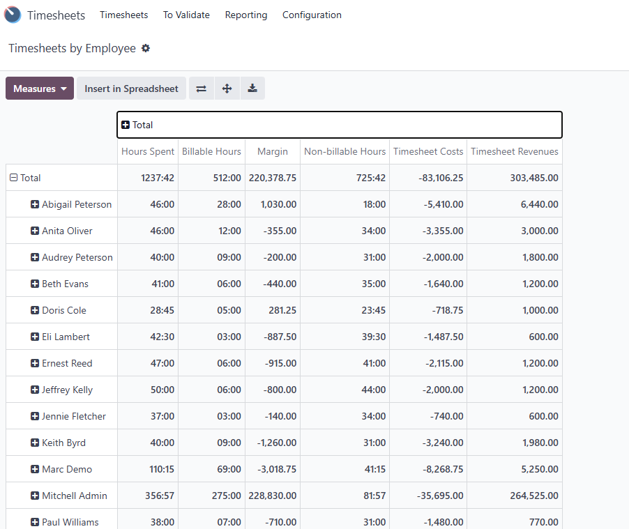
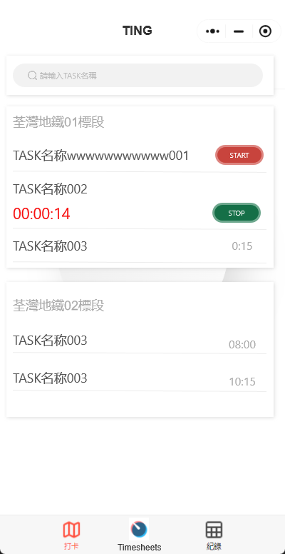

# USC Odoo User Guide - Timesheet Management

## Overview
Timesheet management in Odoo is essential for accurately tracking work hours, linking labor costs to sales orders, and automating billing processes. This guide outlines the timesheet workflow, its impact on sales orders and invoices, manager review processes, and the upcoming WeChat Mini App feature for enhanced mobility.

---

## Prerequisite

Before managing timesheets, make sure you have completed the following steps:

- [Sales Order Management](./sale-order-management.md)
- [Project Management](./project-management.md)
- [Milestone and Delivery Management](./milestone_and_delivery.md)

Also, ensure you are logged into the Odoo system:

- [How to Log into Odoo](../getting-start/logging-into.md)

---

## Timesheet Management Workflow
  
*The entry point of Timesheet*

1. **Start Tracking Work:**
      - Go to the **Timesheet** module in Odoo.
      - Select the **Project** and **Task** associated with the sales order.
      - Start the timer or manually enter the start time.  
        
      *Timesheet starting*  
        
      *Timesheet project and task selection*

2. **Work on the Task:**
      - Complete the assigned work, updating the task status as needed.
      - Add notes or descriptions to provide context for the logged time.  

3. **End Tracking:**
      - Stop the timer or manually enter the end time.
      - Review the total hours logged and ensure accuracy.  
        
      *Timesheet end*

4. **Manager Review and Approval:**
      - The manager reviews timesheet reports, verifies work completed, and approves or requests changes.

---

## Impact of Timesheets on Sales Orders and Invoices

1. **Sales Order Impact:**
      - Timesheets linked to a sales order contribute to the project’s actual cost records.
      - Helps in comparing estimated labor costs (from the cost sheet) with actual labor expenses.

2. **Invoice Generation:**
      - For products with **Timesheet-Based** or **Milestone** invoicing policies, approved timesheets trigger invoiceable lines.
      - Invoices are generated based on the hours logged and the associated billing rate.

3. **Financial Reporting:**
      - Accurate timesheet data supports detailed project cost reports and profitability analysis.

---

## Manager Review Process

1. **Access Timesheet Reports:**
      - Go to **Timesheets** or **Projects** module and select **Reports**.

2. **Filter by Sales Order or Project:**
      - Use filters to narrow down the timesheets related to specific sales orders or projects.

3. **Review Logged Hours:**
      - Check for accuracy in hours logged, task completion status, and any notes added by team members.

4. **Approve or Request Changes:**
      - Approve timesheets if they align with project expectations.
      - Request corrections if discrepancies are found.

  
*Timesheet project report*  

  
*Timesheet employee report*

---

## WeChat Mini App for Timesheet Tracking (Upcoming Feature)  
1. **Future Enhancement:** The WeChat Mini App will enable users to track work hours by checking in and out from anywhere.  
2. **Improved Flexibility:** Especially useful for remote work or fieldwork scenarios where desktop access is not feasible.  
3. **Real-Time Sync:** Timesheet data will synchronize with Odoo, ensuring that project and sales order records remain up to date.

---

## Best Practices

- **Track Time in Real-Time:** Avoid manual entries when possible to ensure accuracy.
- **Review Timesheets Regularly:** Managers should review timesheets weekly to maintain accurate billing cycles.
- **Align Timesheets with Milestones:** Ensure logged hours contribute to project milestones where applicable.

---

## Troubleshooting

### 1. Timesheet Not Reflected in Sales Order

- **Check Task Assignment:** Ensure the task is correctly linked to the sales order.
- **Verify Project and Sales Order Binding:** The project associated with the task must also be bound to the correct sales order.

### 2. Invoices Not Generating from Timesheets

- **Review Product Invoicing Policy:** Make sure the product's invoicing policy is set to **Timesheet-Based** or **Milestone**.
- **Approve Timesheets:** Only approved timesheets generate invoiceable lines.

---

## IT Support Contact

- **Email:** [ericmok@uscpower.net](mailto:ericmok@uscpower.net)
- **Phone:** +852 6622 7663

---

[<- Back to Index](../../../index.md)

