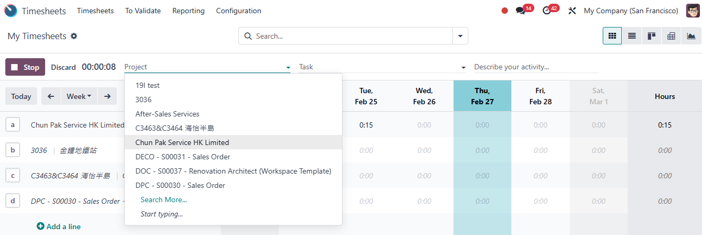
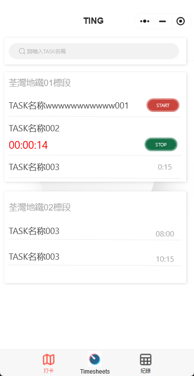
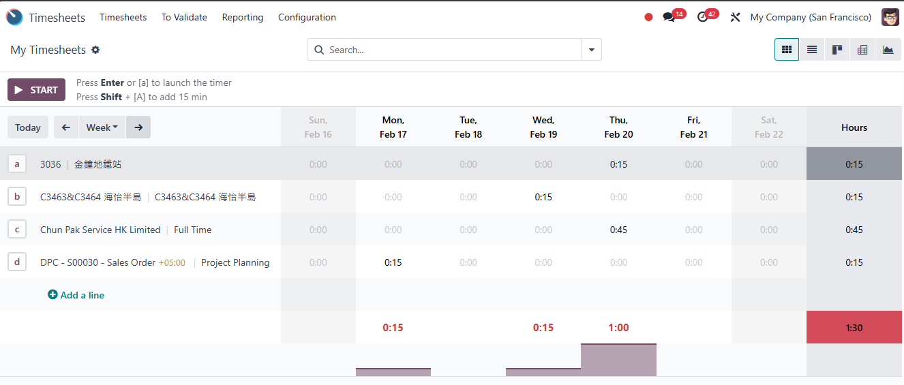

# USC Odoo User Guide - Timesheet Management for Sales Orders

## Overview
Timesheet management in Odoo allows efficient tracking of work hours related to sales orders and projects. This guide covers the native Odoo timesheet process, the upcoming WeChat Mini App integration, personal milestone tracking, and the relationship between timesheets and invoicing.

---

## Prerequisite

Before managing timesheets, make sure you have completed the following steps:

- [Project Management](./project-management.md)
- [Milestone and Delivery Management](./milestone_and_delivery.md)

Also, ensure you are logged into the Odoo system:

- [How to Log into Odoo](../getting-start/logging-into.md)

---

## Timesheet Management Methods

### 1. **Native Timesheet Start/End Process**

1. **Accessing the Timesheet Module:**
      - Navigate to the **Timesheet** module in Odoo.
      - Select the project or task linked to the sales order.

2. **Logging Work Hours:**
      - Start the timer when beginning a task.
      - Stop the timer when the task is completed or when taking breaks.
      - Alternatively, manually enter the start and end times if needed.

3. **Review and Submit:**
      - Verify the recorded hours and submit the timesheet for approval if required.

  
*Timesheet module entry point*  

  
*Timesheet module, **Start** then pick a project for tracking*

---

### 2. **Timesheet Check-In/Check-Out in WeChat Mini App (Available Soon)**

1. **Upcoming Feature:**
   - The WeChat Mini App will allow users to check in and check out directly from their mobile devices.

2. **Task Assignment:**
   - Users can only track time for tasks they are assigned to, ensuring accurate project cost tracking.

3. **Real-Time Sync:**
   - Timesheet data entered in the WeChat Mini App will sync automatically with Odoo, maintaining accurate records.

  
*UI of Timesheet module in WeChat Mini App*

---

## Tracking Milestones Personally

- **Individual Milestone Tracking:**
     - Users can monitor their own progress towards project milestones by checking the completion status of assigned tasks.
     - When a task is completed, it contributes to the overall milestone completion percentage.

- **Impact on Project Billing:**
     - Completed tasks and milestones can trigger invoicing if the product’s invoicing policy is set to **Milestone** or **Timesheet-Based**.

---

## Invoicing with Timesheets

- **Timesheet-Based Invoicing:**
   - Projects and products configured with a **Timesheet-Based** invoicing policy will generate invoices based on approved timesheet entries.
   - Each approved timesheet entry contributes to the billable amount in the sales order or project invoice.

- **Milestone Invoicing Integration:**
   - When milestones are completed, associated timesheets help validate the work done, ensuring accurate invoicing.

  
*Timesheet detial in Week view*

---

## Best Practices

- **Accurate Time Tracking:** Start and stop timers correctly or enter manual times with precision.
- **Regular Timesheet Updates:** Avoid backdating or bulk entries to maintain transparency.
- **Monitor Milestone Progress:** Keep an eye on personal milestones to align work with project billing stages.

---

## Troubleshooting

### 1. Timesheet Not Syncing with Project

- **Check Task Assignment:** Ensure the user is assigned to the correct task in the project.
- **Verify Permissions:** Make sure the user has permission to log timesheets for the specific project.

### 2. Issues with WeChat Mini App

- **Ensure App Integration:** Confirm that the app is connected to Odoo correctly.
- **Update Timesheets Manually:** If the app is not syncing, timesheets can be updated manually in the Odoo interface.

---

## IT Support Contact

- **Email:** [ericmok@uscpower.net](mailto:ericmok@uscpower.net)
- **Phone:** +852 6622 7663

---

[<- Back to Index](../../../index.md)

