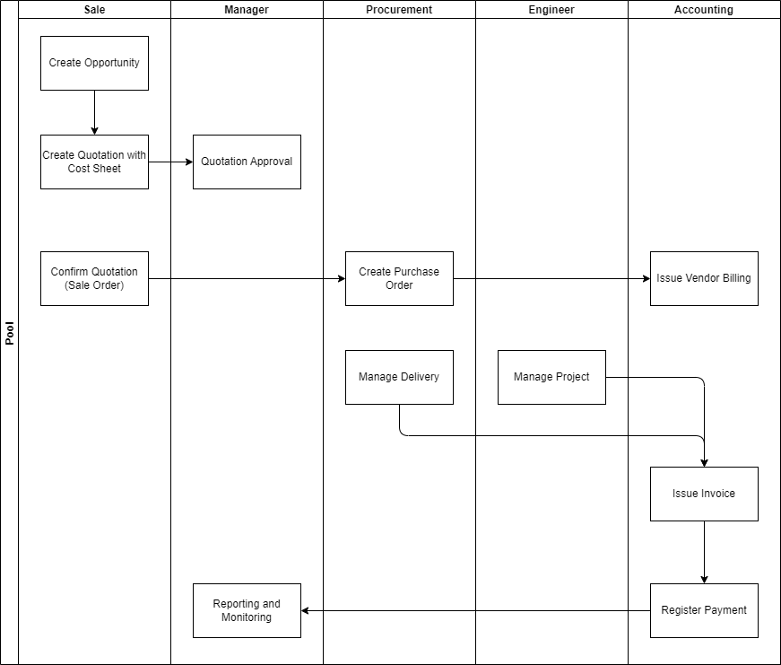

# User Guide: Order Workflow in Odoo

## Introduction

This guide outlines the order workflow in Odoo, focusing on user roles and their specific responsibilities. Each role will have clear tasks assigned to ensure accountability and efficiency.

---

## The Entire Workflow
  

The workflow follows a structured route to ensure seamless order processing:

1. **Sales Team** creates an opportunity in [CRM](./guides/odoo/order-management/crm-opportunity.md) and prepares a [Quotation](./guides/odoo/order-management/quotation-management.md) with a cost sheet.
2. **Manager** reviews and [Approves/Rejects the Quotation](./guides/odoo/order-management/quotation-approval.md).
3. **Sales Team** confirms the approved quotation into a sales order.
4. **Procurement Team** creates a [Purchase Order](./guides/odoo/purchase-order-management/purchase-order-for-sale.md) if necessary.
5. **Engineer/Project Team** manages [Delivery, Tasks, and Milestones](./guides/odoo/order-management/milestone_and_delivery.md).
6. **Accounting Team** issues an invoice based on the sales order or project milestones.
7. **Accounting Team** registers payment and updates financial records.
8. **Manager** oversees reporting and monitoring for business insights.

---

## Responsibilities by Role

### 1. Sales Team Responsibilities

- **CRM Management**: Create and track opportunities, interact with customers. Ensure that every inquiry, including emails and calls, is logged as an opportunity. Rate the opportunities based on potential value and urgency to prioritize follow-ups.
- **Quotation Management**: Generate quotations with cost sheets, submit for approval. The cost sheet must be submitted along with the quotation. The cost sheet template can be found [here](./guides/odoo/templates/cost_sheet_template.xlsx).
- **Sales Order Confirmation**: Convert approved quotations to sales orders (Only Steven Law has corresponding Permission), notify relevant teams.
- **Procurement Coordination**: Request purchase orders if required.

---

### 2. Manager Responsibilities

- **Quotation Approval**: Review submitted quotations, approve or reject.
- **Monitoring & Reporting**: Track order workflows, review financial and sales performance.

---

### 3. Procurement Team Responsibilities (If Applicable)

- **Purchase Order Management**: Create and track purchase orders.
- **Order Linkage**: Ensure purchase orders align with sales orders and projects.

---

### 4. Engineering & Project Team Responsibilities

- **Delivery Management**: Oversee timely delivery of goods/services.
- **Project & Task Tracking**: Manage milestones, ensure progress updates. Projects and tasks will be created automatically if the correct product is chosen during quotation creation. Add or remove tasks as needed. Assign people and manage deadlines as desired. Mark tasks as done when completed.

---

### 5. Accounting Team Responsibilities

- **Invoicing**: Issue invoices upon milestone or order completion.
- **Payment Registration**: Record payments and update financial records.

## IT Support Contact  

- **Email:** [ericmok@uscpower.net](mailto:ericmok@uscpower.net)  
- **Phone:** +852 6622 7663  

---

[<- Back to Index](./index.md)  